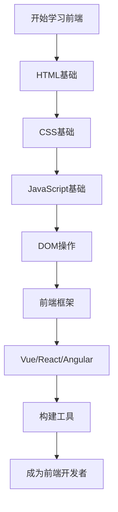

## 什么是前端开发？

前端开发是指创建网站或Web应用程序用户界面的过程。前端开发者负责实现用户直接看到和交互的所有内容，包括布局、样式、动画和用户交互功能。

## 前端开发三剑客

### 1. HTML - 网页的骨架

HTML（HyperText Markup Language，超文本标记语言）是构建网页结构的基础。

```html
<!DOCTYPE html>
<html lang="zh-CN">
<head>
    <meta charset="UTF-8">
    <title>我的第一个网页</title>
</head>
<body>
    <h1>欢迎来到前端世界</h1>
    <p>这是一个段落。</p>
</body>
</html>
```

**常用HTML标签：**
- `<h1>` - `<h6>`: 标题标签
- `<p>`: 段落
- `<div>`: 容器
- `<a>`: 链接
- ``: 图片
- `<ul>`, `<ol>`, `<li>`: 列表

### 2. CSS - 网页的外观

CSS（Cascading Style Sheets，层叠样式表）用于控制网页的样式和布局。

```css
/* 基础样式示例 */
body {
    font-family: Arial, sans-serif;
    background-color: #f5f5f5;
    margin: 0;
    padding: 20px;
}

h1 {
    color: #333;
    text-align: center;
}

.container {
    max-width: 1200px;
    margin: 0 auto;
    background-color: white;
    padding: 20px;
    border-radius: 8px;
}
```

**CSS核心概念：**
- 选择器（Selectors）
- 盒模型（Box Model）
- 布局（Layout）：Flexbox、Grid
- 响应式设计（Responsive Design）
- 动画和过渡（Animations & Transitions）

### 3. JavaScript - 网页的行为

JavaScript是一门编程语言，为网页添加交互功能和动态效果。

```js
// JavaScript基础示例
function greet(name) {
    return `你好，${name}！欢迎学习前端开发。`;
}

// DOM操作
document.querySelector('button').addEventListener('click', function() {
    alert(greet('同学'));
});

// 数组操作
const fruits = ['苹果', '香蕉', '橙子'];
fruits.forEach(fruit => {
    console.log(fruit);
});
```

## 学习路线图



## 实战项目：制作个人名片

让我们结合三种技术创建一个简单的个人名片：

```html title="index.html"
<!DOCTYPE html>
<html lang="zh-CN">
<head>
    <meta charset="UTF-8">
    <meta name="viewport" content="width=device-width, initial-scale=1.0">
    <title>个人名片</title>
    <link rel="stylesheet" href="style.css">
</head>
<body>
    <div class="card">
        <div class="avatar">👨‍💻</div>
        <h2>张三</h2>
        <p class="title">前端开发工程师</p>
        <div class="skills">
            <span class="skill">HTML</span>
            <span class="skill">CSS</span>
            <span class="skill">JavaScript</span>
        </div>
        <button id="contactBtn">联系我</button>
    </div>
    <script src="script.js"></script>
</body>
</html>
```

```css title="style.css"
body {
    display: flex;
    justify-content: center;
    align-items: center;
    min-height: 100vh;
    background: linear-gradient(135deg, #667eea 0%, #764ba2 100%);
    font-family: 'Arial', sans-serif;
}

.card {
    background: white;
    padding: 40px;
    border-radius: 20px;
    box-shadow: 0 20px 60px rgba(0,0,0,0.3);
    text-align: center;
    transition: transform 0.3s;
}

.card:hover {
    transform: translateY(-10px);
}

.avatar {
    font-size: 80px;
    margin-bottom: 20px;
}

h2 {
    margin: 10px 0;
    color: #333;
}

.title {
    color: #666;
    margin-bottom: 20px;
}

.skills {
    margin: 20px 0;
}

.skill {
    display: inline-block;
    background: #667eea;
    color: white;
    padding: 8px 16px;
    border-radius: 20px;
    margin: 5px;
    font-size: 14px;
}

button {
    background: #667eea;
    color: white;
    border: none;
    padding: 12px 30px;
    border-radius: 25px;
    cursor: pointer;
    font-size: 16px;
    transition: background 0.3s;
}

button:hover {
    background: #764ba2;
}
```

```js title="script.js"
document.getElementById('contactBtn').addEventListener('click', function() {
    alert('感谢您的关注！\n邮箱: zhangsan@example.com');
});
```

## 学习资源推荐

### 在线教程
- [MDN Web Docs](https://developer.mozilla.org/) - 最权威的Web技术文档
- [菜鸟教程](https://www.runoob.com/) - 中文入门教程
- [FreeCodeCamp](https://www.freecodecamp.org/) - 免费编程课程

### 实践平台
- [CodePen](https://codepen.io/) - 在线代码编辑器
- [JSFiddle](https://jsfiddle.net/) - 测试和分享代码片段
- [LeetCode](https://leetcode.cn/) - 算法练习

### 前端框架
- **Vue.js** - 渐进式JavaScript框架，易学易用
- **React** - Facebook开发的UI库，生态丰富
- **Angular** - Google维护的完整框架

## 开发工具

:::tip[推荐工具]
- **代码编辑器**: VS Code（强烈推荐）
- **浏览器**: Chrome + DevTools
- **版本控制**: Git + GitHub
- **包管理器**: npm 或 yarn
:::

## 学习建议

1. **循序渐进**：先掌握HTML和CSS，再学习JavaScript
2. **多动手实践**：理论和实践相结合，做小项目巩固知识
3. **阅读文档**：养成查阅官方文档的习惯
4. **参与社区**：加入技术社区，向他人学习
5. **持续学习**：前端技术更新快，保持学习热情

:::important[重要提醒]
前端开发不是一蹴而就的，需要时间和耐心。不要急于求成，扎实掌握基础才是关键！
:::

## 常见问题

### Q: 学习前端需要多长时间？
A: 掌握基础知识大约需要3-6个月，但要成为熟练的开发者需要持续学习和实践1-2年。

### Q: 需要数学基础吗？
A: 基础的前端开发不需要很强的数学能力，但学习算法和动画时会用到一些数学知识。

### Q: 先学哪个框架好？
A: 建议先扎实学好JavaScript基础，再选择Vue（相对简单）或React（生态更大）开始学习。

## 总结

前端开发是一个充满创造力和挑战的领域。通过学习HTML、CSS和JavaScript这三大核心技术，你可以构建出精美的网页和强大的Web应用。记住：

- 📚 **基础最重要** - 打好基础才能走得更远
- 💪 **多加练习** - 实践出真知
- 🤝 **保持热情** - 享受编程的乐趣

现在就开始你的前端开发之旅吧！祝你学习顺利！🚀