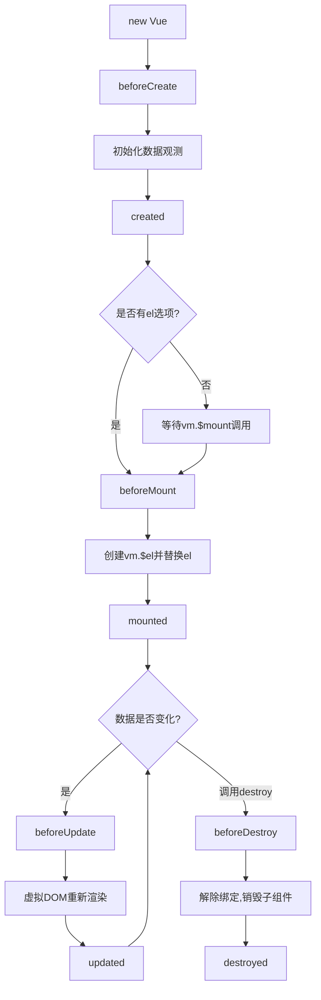

## 什么是Vue.js？

Vue.js是一套用于构建用户界面的**渐进式JavaScript框架**。与其它大型框架不同的是,Vue被设计为可以自底向上逐层应用。Vue的核心库只关注视图层,不仅易于上手,还便于与第三方库或既有项目整合。

### Vue的特点

- 📦 **轻量级** - 核心库压缩后仅20KB左右
- 🚀 **高性能** - 虚拟DOM,高效更新
- 📖 **易学习** - API简洁,文档完善
- 🔧 **渐进式** - 可以按需使用功能
- 🎯 **组件化** - 提高代码复用性

## 安装Vue2

### 方式一: CDN引入

最简单的方式,适合学习和小型项目:

```html
<!-- 开发环境版本,包含完整的警告和调试模式 -->
<script src="https://cdn.jsdelivr.net/npm/vue@2.7.14/dist/vue.js"></script>

<!-- 生产环境版本,优化了尺寸和速度 -->
<script src="https://cdn.jsdelivr.net/npm/vue@2.7.14"></script>
```

### 方式二: NPM安装

适合大型应用开发:

```bash
# 创建项目目录
mkdir my-vue-project
cd my-vue-project

# 初始化项目
npm init -y

# 安装Vue2
npm install vue@2.7.14
```

### 方式三: Vue CLI脚手架

快速搭建Vue项目:

```bash
# 全局安装Vue CLI
npm install -g @vue/cli

# 创建项目
vue create my-project

# 选择Vue 2.x
```

## 第一个Vue应用

让我们创建第一个Vue应用,体验Vue的魅力:

```html title="hello-vue.html"
<!DOCTYPE html>
<html lang="zh-CN">
<head>
    <meta charset="UTF-8">
    <title>我的第一个Vue应用</title>
    <script src="https://cdn.jsdelivr.net/npm/vue@2.7.14/dist/vue.js"></script>
</head>
<body>
    <div id="app">
        <h1>{{ message }}</h1>
        <p>{{ description }}</p>
    </div>

    <script>
        var app = new Vue({
            el: '#app',
            data: {
                message: '你好,Vue!',
                description: '这是我的第一个Vue应用'
            }
        })
    </script>
</body>
</html>
```

打开浏览器,你会看到页面显示了我们定义的消息!

## Vue实例

每个Vue应用都是通过创建一个**Vue实例**开始的:

```js
var vm = new Vue({
    // 选项
})
```

### 核心选项

```js
var app = new Vue({
    // 1. 挂载点 - 指定Vue实例管理的DOM元素
    el: '#app',
    
    // 2. 数据 - 响应式数据对象
    data: {
        message: 'Hello Vue!',
        count: 0,
        items: ['苹果', '香蕉', '橙子']
    },
    
    // 3. 方法 - 定义事件处理函数
    methods: {
        increment() {
            this.count++
        },
        greet(name) {
            alert('你好,' + name)
        }
    },
    
    // 4. 计算属性 - 基于依赖缓存的属性
    computed: {
        reversedMessage() {
            return this.message.split('').reverse().join('')
        }
    },
    
    // 5. 侦听器 - 监听数据变化
    watch: {
        count(newVal, oldVal) {
            console.log('count变化了:', oldVal, '->', newVal)
        }
    }
})
```

## 模板语法

Vue使用基于HTML的模板语法,将DOM绑定到Vue实例的数据。

### 文本插值

使用双大括号`{{ }}`进行文本插值:

```html
<div id="app">
    <p>{{ message }}</p>
    <p>{{ number + 1 }}</p>
    <p>{{ ok ? '是' : '否' }}</p>
    <p>{{ message.split('').reverse().join('') }}</p>
</div>

<script>
new Vue({
    el: '#app',
    data: {
        message: 'Hello Vue',
        number: 10,
        ok: true
    }
})
</script>
```

### HTML插值

使用`v-html`指令输出HTML:

```html
<div id="app">
    <p>使用文本插值: {{ rawHtml }}</p>
    <p>使用v-html: <span v-html="rawHtml"></span></p>
</div>

<script>
new Vue({
    el: '#app',
    data: {
        rawHtml: '<span style="color: red">红色文字</span>'
    }
})
</script>
```

:::warning[安全提醒]
永远不要对用户提供的内容使用`v-html`,这会导致XSS攻击!
:::

## 常用指令

Vue指令是带有`v-`前缀的特殊属性。

### v-bind - 属性绑定

绑定HTML属性:

```html
<div id="app">
    <!-- 完整语法 -->
    
    
    <!-- 缩写 -->
    
    
    <!-- 绑定class -->
    <div :class="{ active: isActive, 'text-danger': hasError }"></div>
    
    <!-- 绑定style -->
    <div :style="{ color: textColor, fontSize: fontSize + 'px' }"></div>
</div>

<script>
new Vue({
    el: '#app',
    data: {
        imageSrc: 'https://vuejs.org/images/logo.png',
        imageAlt: 'Vue Logo',
        isActive: true,
        hasError: false,
        textColor: 'red',
        fontSize: 20
    }
})
</script>
```

### v-if / v-else / v-else-if - 条件渲染

根据条件渲染元素:

```html
<div id="app">
    <h1 v-if="score >= 90">优秀</h1>
    <h1 v-else-if="score >= 80">良好</h1>
    <h1 v-else-if="score >= 60">及格</h1>
    <h1 v-else>不及格</h1>
    
    <button @click="score += 10">加10分</button>
    <button @click="score -= 10">减10分</button>
    <p>当前分数: {{ score }}</p>
</div>

<script>
new Vue({
    el: '#app',
    data: {
        score: 75
    }
})
</script>
```

### v-show - 显示隐藏

通过CSS display控制显示:

```html
<div id="app">
    <p v-show="isVisible">我可以被隐藏</p>
    <button @click="isVisible = !isVisible">切换显示</button>
</div>

<script>
new Vue({
    el: '#app',
    data: {
        isVisible: true
    }
})
</script>
```

:::tip[v-if vs v-show]
- `v-if`: 真正的条件渲染,有更高的切换开销
- `v-show`: 始终渲染,只是切换CSS display,有更高的初始渲染开销
- 频繁切换用`v-show`,运行时条件很少改变用`v-if`
:::

### v-for - 列表渲染

遍历数组或对象:

```html
<div id="app">
    <!-- 遍历数组 -->
    <ul>
        <li v-for="(item, index) in fruits" :key="index">
            {{ index + 1 }}. {{ item }}
        </li>
    </ul>
    
    <!-- 遍历对象 -->
    <ul>
        <li v-for="(value, key, index) in user" :key="key">
            {{ key }}: {{ value }}
        </li>
    </ul>
    
    <!-- 遍历数字 -->
    <span v-for="n in 10" :key="n">{{ n }} </span>
</div>

<script>
new Vue({
    el: '#app',
    data: {
        fruits: ['苹果', '香蕉', '橙子', '葡萄'],
        user: {
            name: '张三',
            age: 25,
            email: 'zhangsan@example.com'
        }
    }
})
</script>
```

:::important[key属性]
使用`v-for`时,建议提供唯一的`key`属性,这有助于Vue识别节点,提高渲染性能。
:::

### v-on - 事件监听

监听DOM事件:

```html
<div id="app">
    <p>计数: {{ count }}</p>
    
    <!-- 完整语法 -->
    <button v-on:click="count++">增加</button>
    
    <!-- 缩写 -->
    <button @click="count--">减少</button>
    
    <!-- 调用方法 -->
    <button @click="reset">重置</button>
    
    <!-- 传递参数 -->
    <button @click="addNum(5)">加5</button>
    
    <!-- 事件修饰符 -->
    <button @click.stop="handleClick">阻止冒泡</button>
    <form @submit.prevent="onSubmit">
        <button type="submit">提交(阻止默认)</button>
    </form>
</div>

<script>
new Vue({
    el: '#app',
    data: {
        count: 0
    },
    methods: {
        reset() {
            this.count = 0
        },
        addNum(num) {
            this.count += num
        },
        handleClick() {
            alert('按钮被点击')
        },
        onSubmit() {
            console.log('表单提交')
        }
    }
})
</script>
```

### v-model - 双向绑定

在表单元素上创建双向数据绑定:

```html
<div id="app">
    <!-- 输入框 -->
    <input v-model="message" placeholder="输入内容">
    <p>输入的内容: {{ message }}</p>
    
    <!-- 多行文本 -->
    <textarea v-model="text" rows="3"></textarea>
    <p style="white-space: pre-line">{{ text }}</p>
    
    <!-- 复选框 -->
    <input type="checkbox" v-model="checked" id="checkbox">
    <label for="checkbox">{{ checked }}</label>
    
    <!-- 多个复选框 -->
    <div>
        <input type="checkbox" value="苹果" v-model="fruits" id="apple">
        <label for="apple">苹果</label>
        
        <input type="checkbox" value="香蕉" v-model="fruits" id="banana">
        <label for="banana">香蕉</label>
        
        <input type="checkbox" value="橙子" v-model="fruits" id="orange">
        <label for="orange">橙子</label>
        
        <p>选中的水果: {{ fruits }}</p>
    </div>
    
    <!-- 单选按钮 -->
    <div>
        <input type="radio" value="男" v-model="gender" id="male">
        <label for="male">男</label>
        
        <input type="radio" value="女" v-model="gender" id="female">
        <label for="female">女</label>
        
        <p>性别: {{ gender }}</p>
    </div>
    
    <!-- 下拉选择 -->
    <select v-model="selected">
        <option disabled value="">请选择</option>
        <option>北京</option>
        <option>上海</option>
        <option>广州</option>
        <option>深圳</option>
    </select>
    <p>选择的城市: {{ selected }}</p>
</div>

<script>
new Vue({
    el: '#app',
    data: {
        message: '',
        text: '',
        checked: false,
        fruits: [],
        gender: '',
        selected: ''
    }
})
</script>
```

## 计算属性

计算属性是基于依赖进行缓存的,只有相关依赖发生改变时才会重新计算:

```html
<div id="app">
    <p>原始消息: {{ message }}</p>
    <p>反转消息: {{ reversedMessage }}</p>
    <p>全名: {{ fullName }}</p>
    
    <input v-model="firstName" placeholder="名">
    <input v-model="lastName" placeholder="姓">
</div>

<script>
new Vue({
    el: '#app',
    data: {
        message: 'Hello Vue',
        firstName: '三',
        lastName: '张'
    },
    computed: {
        // 计算属性的getter
        reversedMessage() {
            return this.message.split('').reverse().join('')
        },
        fullName() {
            return this.lastName + this.firstName
        }
    }
})
</script>
```

### 计算属性 vs 方法

```html
<div id="app">
    <!-- 使用计算属性 -->
    <p>{{ reversedMessage }}</p>
    <p>{{ reversedMessage }}</p>
    
    <!-- 使用方法 -->
    <p>{{ reverseMessage() }}</p>
    <p>{{ reverseMessage() }}</p>
</div>

<script>
new Vue({
    el: '#app',
    data: {
        message: 'Hello'
    },
    computed: {
        // 计算属性会缓存,只计算一次
        reversedMessage() {
            console.log('计算属性执行')
            return this.message.split('').reverse().join('')
        }
    },
    methods: {
        // 方法每次都会执行
        reverseMessage() {
            console.log('方法执行')
            return this.message.split('').reverse().join('')
        }
    }
})
</script>
```

## 侦听器

侦听器用于观察和响应Vue实例上的数据变动:

```html
<div id="app">
    <p>问一个yes/no问题:
        <input v-model="question">
    </p>
    <p>{{ answer }}</p>
</div>

<script>
new Vue({
    el: '#app',
    data: {
        question: '',
        answer: '你还没有输入问题'
    },
    watch: {
        // 当question发生变化时执行
        question(newQuestion, oldQuestion) {
            this.answer = '等待输入停止...'
            this.getAnswer()
        }
    },
    methods: {
        getAnswer() {
            if (this.question.indexOf('?') === -1) {
                this.answer = '问题通常包含问号'
                return
            }
            this.answer = '思考中...'
            setTimeout(() => {
                this.answer = '可能是,可能不是'
            }, 1000)
        }
    }
})
</script>
```

## 实战练习: Todo List

让我们综合运用所学知识,创建一个待办事项应用:

```html title="todo-list.html"
<!DOCTYPE html>
<html lang="zh-CN">
<head>
    <meta charset="UTF-8">
    <title>Vue Todo List</title>
    <script src="https://cdn.jsdelivr.net/npm/vue@2.7.14/dist/vue.js"></script>
    <style>
        * { margin: 0; padding: 0; box-sizing: border-box; }
        body {
            font-family: Arial, sans-serif;
            background: linear-gradient(135deg, #667eea 0%, #764ba2 100%);
            min-height: 100vh;
            display: flex;
            justify-content: center;
            align-items: center;
            padding: 20px;
        }
        #app {
            background: white;
            border-radius: 10px;
            padding: 30px;
            box-shadow: 0 20px 60px rgba(0,0,0,0.3);
            width: 100%;
            max-width: 500px;
        }
        h1 {
            text-align: center;
            color: #333;
            margin-bottom: 20px;
        }
        .input-box {
            display: flex;
            margin-bottom: 20px;
        }
        input[type="text"] {
            flex: 1;
            padding: 10px;
            border: 2px solid #ddd;
            border-radius: 5px 0 0 5px;
            font-size: 16px;
        }
        button {
            padding: 10px 20px;
            background: #667eea;
            color: white;
            border: 
none;
            border-radius: 0 5px 5px 0;
            cursor: pointer;
            font-size: 16px;
        }
        button:hover {
            background: #764ba2;
        }
        .filters {
            display: flex;
            justify-content: center;
            gap: 10px;
            margin-bottom: 20px;
        }
        .filters button {
            border-radius: 5px;
            padding: 8px 16px;
            background: #f0f0f0;
            color: #333;
        }
        .filters button.active {
            background: #667eea;
            color: white;
        }
        .todo-list {
            list-style: none;
        }
        .todo-item {
            display: flex;
            align-items: center;
            padding: 12px;
            border-bottom: 1px solid #eee;
            transition: background 0.3s;
        }
        .todo-item:hover {
            background: #f9f9f9;
        }
        .todo-item.completed {
            opacity: 0.6;
        }
        .todo-item.completed .todo-text {
            text-decoration: line-through;
            color: #999;
        }
        .todo-checkbox {
            margin-right: 10px;
            cursor: pointer;
        }
        .todo-text {
            flex: 1;
            font-size: 16px;
        }
        .delete-btn {
            background: #ff6b6b;
            padding: 5px 10px;
            font-size: 14px;
            border-radius: 5px;
        }
        .delete-btn:hover {
            background: #ff5252;
        }
        .stats {
            margin-top: 20px;
            text-align: center;
            color: #666;
        }
    </style>
</head>
<body>
    <div id="app">
        <h1>📝 待办事项</h1>
        
        <!-- 输入框 -->
        <div class="input-box">
            <input 
                type="text" 
                v-model="newTodo" 
                @keyup.enter="addTodo"
                placeholder="添加新任务..."
            >
            <button @click="addTodo">添加</button>
        </div>
        
        <!-- 过滤按钮 -->
        <div class="filters">
            <button 
                :class="{ active: filter === 'all' }"
                @click="filter = 'all'"
            >全部</button>
            <button 
                :class="{ active: filter === 'active' }"
                @click="filter = 'active'"
            >进行中</button>
            <button 
                :class="{ active: filter === 'completed' }"
                @click="filter = 'completed'"
            >已完成</button>
        </div>
        
        <!-- 任务列表 -->
        <ul class="todo-list">
            <li 
                v-for="todo in filteredTodos" 
                :key="todo.id"
                :class="['todo-item', { completed: todo.completed }]"
            >
                <input 
                    type="checkbox" 
                    class="todo-checkbox"
                    v-model="todo.completed"
                >
                <span class="todo-text">{{ todo.text }}</span>
                <button class="delete-btn" @click="deleteTodo(todo.id)">
                    删除
                </button>
            </li>
        </ul>
        
        <!-- 统计信息 -->
        <div class="stats">
            <p>共 {{ todos.length }} 项任务，
               已完成 {{ completedCount }} 项，
               剩余 {{ activeCount }} 项</p>
        </div>
    </div>

    <script>
        new Vue({
            el: '#app',
            data: {
                newTodo: '',
                filter: 'all',
                todos: [
                    { id: 1, text: '学习Vue基础', completed: true },
                    { id: 2, text: '完成Todo应用', completed: false },
                    { id: 3, text: '学习组件通信', completed: false }
                ]
            },
            computed: {
                // 过滤后的任务列表
                filteredTodos() {
                    if (this.filter === 'active') {
                        return this.todos.filter(todo => !todo.completed)
                    } else if (this.filter === 'completed') {
                        return this.todos.filter(todo => todo.completed)
                    }
                    return this.todos
                },
                // 已完成数量
                completedCount() {
                    return this.todos.filter(todo => todo.completed).length
                },
                // 未完成数量
                activeCount() {
                    return this.todos.filter(todo => !todo.completed).length
                }
            },
            methods: {
                // 添加任务
                addTodo() {
                    if (this.newTodo.trim()) {
                        this.todos.push({
                            id: Date.now(),
                            text: this.newTodo,
                            completed: false
                        })
                        this.newTodo = ''
                    }
                },
                // 删除任务
                deleteTodo(id) {
                    const index = this.todos.findIndex(todo => todo.id === id)
                    if (index > -1) {
                        this.todos.splice(index, 1)
                    }
                }
            }
        })
    </script>
</body>
</html>
```

## 生命周期钩子

Vue实例有一个完整的生命周期,从创建到销毁,在不同阶段会调用不同的钩子函数:

```js
new Vue({
    el: '#app',
    data: {
        message: 'Hello'
    },
    // 实例初始化之后,数据观测和事件配置之前
    beforeCreate() {
        console.log('beforeCreate: 实例刚被创建')
    },
    // 实例创建完成,数据观测已完成
    created() {
        console.log('created: 实例创建完成')
        // 可以访问data、computed、methods等
        console.log('message:', this.message)
    },
    // 在挂载开始之前被调用
    beforeMount() {
        console.log('beforeMount: 挂载之前')
    },
    // el被新创建的vm.$el替换,并挂载到实例上
    mounted() {
        console.log('mounted: 挂载完成')
        // DOM已经渲染完成,可以进行DOM操作
        console.log('DOM内容:', this.$el.innerHTML)
    },
    // 数据更新时调用
    beforeUpdate() {
        console.log('beforeUpdate: 数据更新,DOM未更新')
    },
    // 数据更改导致的虚拟DOM重新渲染完毕
    updated() {
        console.log('updated: DOM更新完成')
    },
    // 实例销毁之前调用
    beforeDestroy() {
        console.log('beforeDestroy: 销毁之前')
    },
    // 实例销毁后调用
    destroyed() {
        console.log('destroyed: 已销毁')
    }
})
```

### 生命周期图示



## 过滤器

Vue2允许自定义过滤器,用于文本格式化:

```html
<div id="app">
    <!-- 使用过滤器 -->
    <p>{{ message | capitalize }}</p>
    <p>{{ price | currency }}</p>
    <p>{{ date | formatDate }}</p>
    
    <!-- 串联过滤器 -->
    <p>{{ message | lowercase | reverse }}</p>
</div>

<script>
new Vue({
    el: '#app',
    data: {
        message: 'hello world',
        price: 12345.67,
        date: new Date()
    },
    filters: {
        // 首字母大写
        capitalize(value) {
            if (!value) return ''
            value = value.toString()
            return value.charAt(0).toUpperCase() + value.slice(1)
        },
        // 转小写
        lowercase(value) {
            return value.toLowerCase()
        },
        // 反转
        reverse(value) {
            return value.split('').reverse().join('')
        },
        // 货币格式化
        currency(value) {
            return '¥' + value.toFixed(2)
        },
        // 日期格式化
        formatDate(value) {
            const date = new Date(value)
            const year = date.getFullYear()
            const month = String(date.getMonth() + 1).padStart(2, '0')
            const day = String(date.getDate()).padStart(2, '0')
            return `${year}-${month}-${day}`
        }
    }
})
</script>
```

## 学习建议

1. **循序渐进**: 先掌握基础指令和模板语法
2. **多敲代码**: 跟着教程动手实践每个示例
3. **理解原理**: 了解Vue的响应式原理和虚拟DOM
4. **查阅文档**: 遇到问题先查Vue官方文档
5. **做小项目**: 通过实战项目巩固知识

## 下一步学习

在掌握了Vue2基础知识后,接下来应该学习:

- ✅ **组件系统** - 组件注册、Props、自定义事件
- ✅ **组件通信** - 父子通信、兄弟通信、跨级通信
- ✅ **Vue Router** - 单页应用路由管理
- ✅ **Vuex** - 全局状态管理
- ✅ **Vue CLI** - 项目脚手架和工程化

## 总结

本文介绍了Vue2的核心基础知识:

- Vue实例的创建和选项配置
- 模板语法和数据绑定
- 常用指令(v-bind、v-if、v-for、v-on、v-model等)
- 计算属性和侦听器
- 生命周期钩子函数
- 过滤器的使用

掌握这些基础知识后,你就可以开始构建简单的Vue应用了。在下一篇教程中,我们将深入学习Vue的组件系统!

:::tip[继续学习]
👉 下一篇: [Vue2入门教程(二) - 组件与通信](/posts/vue2-components/)
:::