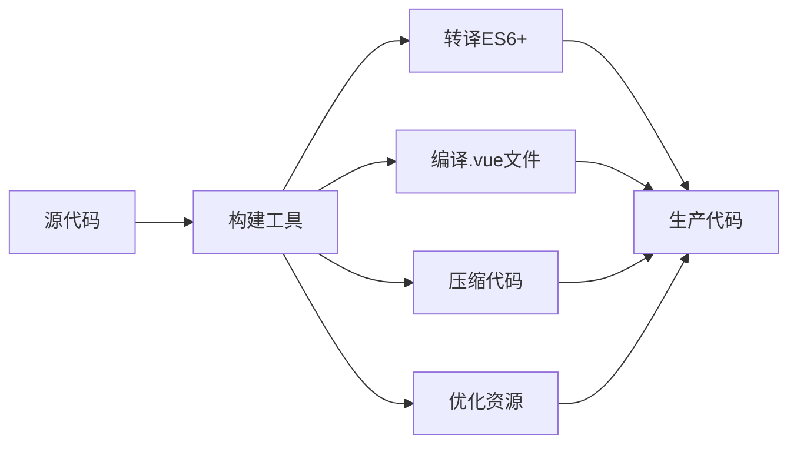
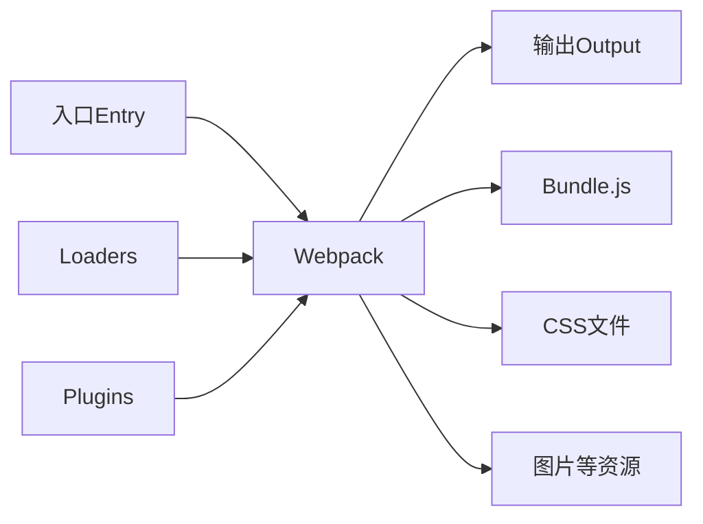

## 📚 系列文章导航

- [Vue2入门教程(一) - 基础知识](/posts/vue2-basics/)
- [Vue2入门教程(二) - 组件与通信](/posts/vue2-components/)
- [Vue2入门教程(三) - Vue Router路由管理](/posts/vue2-router/)
- [Vue2入门教程(四) - Vuex状态管理](/posts/vue2-vuex/)
- **Vue2入门教程(五) - Vue CLI与Webpack构建工具** (当前)

## 前言

在前面的教程中,我们学习了Vue2的基础知识、组件系统、路由管理和状态管理。但在实际开发中,我们需要一套完整的工程化解决方案来管理项目的构建、打包、优化等流程。本文将详细介绍Vue2项目的两大核心工具:Vue CLI和Webpack。

## 一、前端工程化概述

### 1.1 什么是前端工程化

前端工程化是指将前端开发流程规范化、自动化的过程,主要包括:

- **模块化开发**: ES6 Module、CommonJS等模块规范
- **组件化开发**: 可复用的UI组件
- **自动化构建**: 编译、压缩、打包等自动化流程
- **代码规范**: ESLint、Prettier等代码检查工具
- **性能优化**: 代码分割、懒加载、缓存等优化手段
- **开发调试**: 热更新、Source Map等开发辅助工具

### 1.2 为什么需要构建工具



**主要功能:**
- 编译ES6+语法到ES5,兼容更多浏览器
- 将`.vue`单文件组件编译为JavaScript
- 压缩代码,减小文件体积
- 资源优化,提升加载速度
- 提供开发服务器,支持热更新
- 生成Source Map,方便调试

## 二、Vue CLI详解

### 2.1 Vue CLI简介

Vue CLI是Vue官方提供的标准化工具,用于快速搭建Vue项目脚手架。它基于Webpack封装,提供了开箱即用的配置。

**主要特性:**
- 🚀 快速项目初始化
- 🔧 零配置原型开发
- 🎨 丰富的官方插件
- 📦 完整的图形化界面
- 🔌 可扩展的插件系统
- ⚙️ 灵活的配置选项

### 2.2 安装Vue CLI

```bash
# 全局安装Vue CLI
npm install -g @vue/cli

# 或使用yarn
yarn global add @vue/cli

# 查看版本
vue --version
```

### 2.3 创建Vue项目

#### 方式一: 命令行创建

```bash
# 创建新项目
vue create my-project

# 进入项目目录
cd my-project

# 启动开发服务器
npm run serve
```

**创建过程中的选项:**

```bash
? Please pick a preset: (Use arrow keys)
  Default ([Vue 2] babel, eslint)           # 默认配置
  Default (Vue 3) ([Vue 3] babel, eslint)   # Vue3默认配置
❯ Manually select features                  # 手动选择功能

# 手动选择功能
? Check the features needed for your project:
 ◉ Choose Vue version
 ◉ Babel
 ◯ TypeScript
 ◯ Progressive Web App (PWA) Support
 ◉ Router
 ◉ Vuex
 ◉ CSS Pre-processors
 ◉ Linter / Formatter
 ◯ Unit Testing
 ◯ E2E Testing

# 选择Vue版本
? Choose a version of Vue.js:
  3.x
❯ 2.x

# 路由模式
? Use history mode for router? (Y/n) Y

# CSS预处理器
? Pick a CSS pre-processor:
  Sass/SCSS (with dart-sass)
❯ Sass/SCSS (with node-sass)
  Less
  Stylus

# 代码规范
? Pick a linter / formatter config:
  ESLint with error prevention only
  ESLint + Airbnb config
❯ ESLint + Standard config
  ESLint + Prettier

# 何时进行代码检查
? Pick additional lint features:
 ◉ Lint on save               # 保存时检查
 ◉ Lint and fix on commit     # 提交时检查并修复

# 配置文件位置
? Where do you prefer placing config:
❯ In dedicated config files    # 独立的配置文件
  In package.json              # package.json中
```

#### 方式二: 图形化界面创建

```bash
# 启动图形化界面
vue ui
```

浏览器会自动打开 `http://localhost:8000`,通过可视化界面创建和管理项目。

### 2.4 项目结构解析

```
my-project/
├── node_modules/          # 依赖包目录
├── public/               # 静态资源目录
│   ├── favicon.ico      # 网站图标
│   └── index.html       # HTML模板
├── src/                 # 源代码目录
│   ├── assets/         # 资源文件(图片、样式等)
│   ├── components/     # 公共组件
│   ├── router/         # 路由配置
│   │   └── index.js
│   ├── store/          # Vuex状态管理
│   │   └── index.js
│   ├── views/          # 页面组件
│   ├── App.vue         # 根组件
│   └── main.js         # 入口文件
├── .browserslistrc     # 浏览器兼容配置
├── .eslintrc.js        # ESLint配置
├── .gitignore          # Git忽略文件
├── babel.config.js     # Babel配置
├── package.json        # 项目依赖和脚本
└── vue.config.js       # Vue CLI配置(需手动创建)
```

### 2.5 package.json脚本命令

```json
{
  "scripts": {
    "serve": "vue-cli-service serve",      // 启动开发服务器
    "build": "vue-cli-service build",      // 生产环境打包
    "lint": "vue-cli-service lint"         // 代码检查
  }
}
```

**常用命令:**

```bash
# 开发环境运行(支持热更新)
npm run serve

# 生产环境打包
npm run build

# 代码检查
npm run lint

# 代码检查并自动修复
npm run lint -- --fix
```

### 2.6 Vue CLI配置文件

在项目根目录创建 `vue.config.js`:

```javascript
module.exports = {
  // 基本路径
  publicPath: process.env.NODE_ENV === 'production' 
    ? '/my-app/' 
    : '/',
  
  // 输出目录
  outputDir: 'dist',
  
  // 静态资源目录
  assetsDir: 'static',
  
  // 是否在保存时进行ESLint检查
  lintOnSave: true,
  
  // 生产环境是否生成Source Map
  productionSourceMap: false,
  
  // 开发服务器配置
  devServer: {
    port: 8080,
    open: true,  // 自动打开浏览器
    proxy: {
      '/api': {
        target: 'http://localhost:3000',
        changeOrigin: true,
        pathRewrite: {
          '^/api': ''
        }
      }
    }
  },
  
  // CSS相关配置
  css: {
    // 是否提取CSS到单独文件
    extract: process.env.NODE_ENV === 'production',
    // 是否开启CSS Source Map
    sourceMap: false,
    // CSS预处理器配置
    loaderOptions: {
      scss: {
        additionalData: `@import "@/styles/variables.scss";`
      }
    }
  },
  
  // Webpack配置
  configureWebpack: {
    resolve: {
      alias: {
        '@': require('path').resolve(__dirname, 'src'),
        'components': '@/components',
        'views': '@/views'
      }
    }
  },
  
  // 链式操作Webpack配置
  chainWebpack: config => {
    // 修改图片loader
    config.module
      .rule('images')
      .use('url-loader')
      .loader('url-loader')
      .tap(options => Object.assign(options, { limit: 10240 }))
  }
}
```

### 2.7 环境变量配置

Vue CLI支持通过`.env`文件配置环境变量:

```bash
# .env.development (开发环境)
NODE_ENV=development
VUE_APP_API_URL=http://localhost:3000/api
VUE_APP_TITLE=我的应用(开发)

# .env.production (生产环境)
NODE_ENV=production
VUE_APP_API_URL=https://api.example.com
VUE_APP_TITLE=我的应用

# .env.test (测试环境)
NODE_ENV=test
VUE_APP_API_URL=https://test-api.example.com
VUE_APP_TITLE=我的应用(测试)
```

**在代码中使用:**

```javascript
// main.js
console.log('API URL:', process.env.VUE_APP_API_URL)
console.log('应用标题:', process.env.VUE_APP_TITLE)

// 在组件中
export default {
  data() {
    return {
      apiUrl: process.env.VUE_APP_API_URL
    }
  },
  mounted() {
    document.title = process.env.VUE_APP_TITLE
  }
}
```

**指定环境运行:**

```bash
# package.json
{
  "scripts": {
    "serve": "vue-cli-service serve",
    "serve:test": "vue-cli-service serve --mode test",
    "build": "vue-cli-service build",
    "build:test": "vue-cli-service build --mode test"
  }
}
```

## 三、Webpack核心概念

### 3.1 Webpack简介

Webpack是一个现代JavaScript应用的静态模块打包工具。它将项目中的各种资源(JS、CSS、图片等)视为模块,通过loader和plugin进行处理,最终打包成浏览器可识别的文件。



### 3.2 核心概念

#### 1. Entry(入口)

指定Webpack从哪个文件开始构建依赖图:

```javascript
// webpack.config.js
module.exports = {
  entry: './src/main.js',  // 单入口
  
  // 或多入口
  entry: {
    app: './src/main.js',
    vendor: './src/vendor.js'
  }
}
```

#### 2. Output(输出)

指定打包后的文件输出位置和命名:

```javascript
const path = require('path')

module.exports = {
  output: {
    path: path.resolve(__dirname, 'dist'),
    filename: '[name].[contenthash:8].js',  // 使用hash实现缓存
    publicPath: '/'
  }
}
```

#### 3. Loader(加载器)

Webpack默认只能处理JavaScript文件,loader让Webpack能够处理其他类型的文件:

```javascript
module.exports = {
  module: {
    rules: [
      // 处理.vue文件
      {
        test: /\.vue$/,
        loader: 'vue-loader'
      },
      // 处理JavaScript文件
      {
        test: /\.js$/,
        exclude: /node_modules/,
        use: {
          loader: 'babel-loader',
          options: {
            presets: ['@babel/preset-env']
          }
        }
      },
      // 处理CSS文件
      {
        test: /\.css$/,
        use: ['style-loader', 'css-loader']
      },
      // 处理SCSS文件
      {
        test: /\.scss$/,
        use: [
          'style-loader',
          'css-loader',
          'sass-loader'
        ]
      },
      // 处理图片
      {
        test: /\.(png|jpe?g|gif|svg)$/,
        type: 'asset',
        parser: {
          dataUrlCondition: {
            maxSize: 10 * 1024  // 10KB以下转base64
          }
        },
        generator: {
          filename: 'img/[name].[hash:8][ext]'
        }
      },
      // 处理字体
      {
        test: /\.(woff|woff2|eot|ttf|otf)$/,
        type: 'asset/resource',
        generator: {
          filename: 'fonts/[name].[hash:8][ext]'
        }
      }
    ]
  }
}
```

#### 4. Plugin(插件)

Plugin用于执行更广泛的任务,如打包优化、资源管理、环境变量注入等:

```javascript
const HtmlWebpackPlugin = require('html-webpack-plugin')
const { VueLoaderPlugin } = require('vue-loader')
const MiniCssExtractPlugin = require('mini-css-extract-plugin')
const { CleanWebpackPlugin } = require('clean-webpack-plugin')

module.exports = {
  plugins: [
    // Vue Loader插件
    new VueLoaderPlugin(),
    
    // 清理输出目录
    new CleanWebpackPlugin(),
    
    // 生成HTML文件
    new HtmlWebpackPlugin({
      template: './public/index.html',
      filename: 'index.html',
      minify: {
        removeComments: true,
        collapseWhitespace: true
      }
    }),
    
    // 提取CSS到单独文件
    new MiniCssExtractPlugin({
      filename: 'css/[name].[contenthash:8].css'
    })
  ]
}
```

### 3.3 完整的Webpack配置示例

```javascript
// webpack.config.js
const path = require('path')
const HtmlWebpackPlugin = require('html-webpack-plugin')
const { VueLoaderPlugin } = require('vue-loader')
const MiniCssExtractPlugin = require('mini-css-extract-plugin')
const { CleanWebpackPlugin } = require('clean-webpack-plugin')

const isDev = process.env.NODE_ENV === 'development'

module.exports = {
  // 模式
  mode: isDev ? 'development' : 'production',
  
  // 入口
  entry: './src/main.js',
  
  // 输出
  output: {
    path: path.resolve(__dirname, 'dist'),
    filename: isDev ? '[name].js' : '[name].[contenthash:8].js',
    publicPath: '/'
  },
  
  // 模块解析
  resolve: {
    extensions: ['.js', '.vue', '.json'],
    alias: {
      '@': path.resolve(__dirname, 'src'),
      'vue$': 'vue/dist/vue.esm.js'
    }
  },
  
  // 模块规则
  module: {
    rules: [
      {
        test: /\.vue$/,
        loader: 'vue-loader'
      },
      {
        test: /\.js$/,
        exclude: /node_modules/,
        use: 'babel-loader'
      },
      {
        test: /\.css$/,
        use: [
          isDev ? 'style-loader' : MiniCssExtractPlugin.loader,
          'css-loader',
          'postcss-loader'
        ]
      },
      {
        test: /\.scss$/,
        
use: [
          isDev ? 'style-loader' : MiniCssExtractPlugin.loader,
          'css-loader',
          'postcss-loader',
          'sass-loader'
        ]
      },
      {
        test: /\.(png|jpe?g|gif|svg)$/,
        type: 'asset',
        parser: {
          dataUrlCondition: {
            maxSize: 10 * 1024
          }
        }
      }
    ]
  },
  
  // 插件
  plugins: [
    new VueLoaderPlugin(),
    new CleanWebpackPlugin(),
    new HtmlWebpackPlugin({
      template: './public/index.html',
      minify: !isDev
    }),
    new MiniCssExtractPlugin({
      filename: 'css/[name].[contenthash:8].css'
    })
  ],
  
  // 开发服务器
  devServer: {
    port: 8080,
    hot: true,
    open: true,
    proxy: {
      '/api': {
        target: 'http://localhost:3000',
        changeOrigin: true
      }
    }
  },
  
  // Source Map
  devtool: isDev ? 'eval-cheap-module-source-map' : 'source-map',
  
  // 优化
  optimization: {
    splitChunks: {
      chunks: 'all',
      cacheGroups: {
        vendor: {
          test: /[\\/]node_modules[\\/]/,
          name: 'vendors',
          priority: 10
        },
        common: {
          minChunks: 2,
          priority: 5,
          reuseExistingChunk: true
        }
      }
    }
  }
}
```

### 3.4 常用Loader详解

#### babel-loader

将ES6+代码转换为ES5:

```javascript
// .babelrc 或 babel.config.js
module.exports = {
  presets: [
    ['@babel/preset-env', {
      targets: {
        browsers: ['> 1%', 'last 2 versions']
      },
      useBuiltIns: 'usage',
      corejs: 3
    }]
  ],
  plugins: [
    '@babel/plugin-transform-runtime',
    '@babel/plugin-proposal-class-properties'
  ]
}
```

#### vue-loader

处理`.vue`单文件组件:

```javascript
const { VueLoaderPlugin } = require('vue-loader')

module.exports = {
  module: {
    rules: [
      {
        test: /\.vue$/,
        loader: 'vue-loader',
        options: {
          compilerOptions: {
            whitespace: 'condense'
          }
        }
      }
    ]
  },
  plugins: [
    new VueLoaderPlugin()
  ]
}
```

#### css-loader & style-loader

处理CSS文件:

```javascript
{
  test: /\.css$/,
  use: [
    // 开发环境使用style-loader注入到<style>标签
    // 生产环境使用MiniCssExtractPlugin提取到单独文件
    isDev ? 'style-loader' : MiniCssExtractPlugin.loader,
    {
      loader: 'css-loader',
      options: {
        modules: false,  // 是否启用CSS Modules
        importLoaders: 1
      }
    },
    'postcss-loader'  // 自动添加CSS前缀
  ]
}
```

#### file-loader & url-loader

处理文件资源(Webpack 5推荐使用Asset Modules):

```javascript
// Webpack 4
{
  test: /\.(png|jpe?g|gif|svg)$/,
  use: [
    {
      loader: 'url-loader',
      options: {
        limit: 10240,  // 小于10KB转base64
        name: 'img/[name].[hash:8].[ext]'
      }
    }
  ]
}

// Webpack 5
{
  test: /\.(png|jpe?g|gif|svg)$/,
  type: 'asset',
  parser: {
    dataUrlCondition: {
      maxSize: 10 * 1024
    }
  },
  generator: {
    filename: 'img/[name].[hash:8][ext]'
  }
}
```

### 3.5 常用Plugin详解

#### HtmlWebpackPlugin

自动生成HTML文件并注入打包后的资源:

```javascript
new HtmlWebpackPlugin({
  template: './public/index.html',  // 模板文件
  filename: 'index.html',           // 输出文件名
  title: '我的Vue应用',              // 页面标题
  inject: 'body',                   // 脚本注入位置
  minify: {
    removeComments: true,           // 移除注释
    collapseWhitespace: true,       // 压缩空格
    removeAttributeQuotes: true     // 移除属性引号
  },
  chunks: ['app'],                  // 指定要注入的chunk
  chunksSortMode: 'manual'          // chunk排序方式
})
```

#### MiniCssExtractPlugin

提取CSS到单独文件:

```javascript
const MiniCssExtractPlugin = require('mini-css-extract-plugin')

module.exports = {
  plugins: [
    new MiniCssExtractPlugin({
      filename: 'css/[name].[contenthash:8].css',
      chunkFilename: 'css/[name].[contenthash:8].css'
    })
  ]
}
```

#### DefinePlugin

定义全局常量:

```javascript
const webpack = require('webpack')

new webpack.DefinePlugin({
  'process.env': {
    NODE_ENV: JSON.stringify('production'),
    API_URL: JSON.stringify('https://api.example.com')
  },
  __VERSION__: JSON.stringify('1.0.0')
})
```

#### CopyWebpackPlugin

复制静态文件:

```javascript
const CopyWebpackPlugin = require('copy-webpack-plugin')

new CopyWebpackPlugin({
  patterns: [
    {
      from: 'public',
      to: 'dist',
      globOptions: {
        ignore: ['**/index.html']
      }
    }
  ]
})
```

## 四、性能优化

### 4.1 构建速度优化

#### 1. 缩小文件搜索范围

```javascript
module.exports = {
  resolve: {
    // 指定需要解析的文件扩展名
    extensions: ['.js', '.vue', '.json'],
    // 告诉webpack解析模块时应该搜索的目录
    modules: [
      path.resolve(__dirname, 'node_modules')
    ],
    // 配置路径别名
    alias: {
      '@': path.resolve(__dirname, 'src'),
      'vue$': 'vue/dist/vue.esm.js'
    }
  },
  module: {
    rules: [
      {
        test: /\.js$/,
        // 明确指定需要处理的目录
        include: [path.resolve(__dirname, 'src')],
        // 排除不需要处理的目录
        exclude: /node_modules/,
        use: 'babel-loader'
      }
    ]
  }
}
```

#### 2. 使用DllPlugin预编译

```javascript
// webpack.dll.config.js
const webpack = require('webpack')
const path = require('path')

module.exports = {
  entry: {
    vendor: ['vue', 'vue-router', 'vuex', 'axios']
  },
  output: {
    path: path.resolve(__dirname, 'public/dll'),
    filename: '[name].dll.js',
    library: '[name]_library'
  },
  plugins: [
    new webpack.DllPlugin({
      path: path.resolve(__dirname, 'public/dll/[name]-manifest.json'),
      name: '[name]_library'
    })
  ]
}

// webpack.config.js
const webpack = require('webpack')

module.exports = {
  plugins: [
    new webpack.DllReferencePlugin({
      manifest: require('./public/dll/vendor-manifest.json')
    })
  ]
}
```

#### 3. 使用cache缓存

```javascript
// Webpack 5
module.exports = {
  cache: {
    type: 'filesystem',
    cacheDirectory: path.resolve(__dirname, '.temp_cache')
  }
}

// babel-loader缓存
{
  test: /\.js$/,
  use: {
    loader: 'babel-loader',
    options: {
      cacheDirectory: true
    }
  }
}
```

#### 4. 多进程构建

```javascript
const TerserPlugin = require('terser-webpack-plugin')

module.exports = {
  optimization: {
    minimize: true,
    minimizer: [
      new TerserPlugin({
        parallel: true  // 开启多进程压缩
      })
    ]
  }
}
```

### 4.2 打包体积优化

#### 1. 代码分割

```javascript
module.exports = {
  optimization: {
    splitChunks: {
      chunks: 'all',
      minSize: 20000,
      maxSize: 244000,
      minChunks: 1,
      maxAsyncRequests: 30,
      maxInitialRequests: 30,
      cacheGroups: {
        // 提取第三方库
        vendor: {
          test: /[\\/]node_modules[\\/]/,
          name: 'vendors',
          priority: 10,
          reuseExistingChunk: true
        },
        // 提取公共代码
        common: {
          minChunks: 2,
          priority: 5,
          reuseExistingChunk: true,
          name: 'common'
        },
        // 提取Vue全家桶
        vue: {
          test: /[\\/]node_modules[\\/](vue|vue-router|vuex)[\\/]/,
          name: 'vue-vendor',
          priority: 20
        }
      }
    },
    // 提取runtime代码
    runtimeChunk: {
      name: 'runtime'
    }
  }
}
```

#### 2. Tree Shaking

确保使用ES6模块语法,Webpack会自动删除未使用的代码:

```javascript
// package.json
{
  "sideEffects": [
    "*.css",
    "*.scss",
    "*.vue"
  ]
}

// 使用ES6 import/export
import { debounce } from 'lodash-es'  // ✓ 只引入需要的函数
// const _ = require('lodash')  // ✗ 引入整个库
```

#### 3. 压缩代码

```javascript
const TerserPlugin = require('terser-webpack-plugin')
const CssMinimizerPlugin = require('css-minimizer-webpack-plugin')

module.exports = {
  optimization: {
    minimize: true,
    minimizer: [
      // 压缩JavaScript
      new TerserPlugin({
        terserOptions: {
          compress: {
            drop_console: true,  // 删除console
            drop_debugger: true  // 删除debugger
          }
        }
      }),
      // 压缩CSS
      new CssMinimizerPlugin()
    ]
  }
}
```

#### 4. 图片优化

```javascript
const ImageMinimizerPlugin = require('image-minimizer-webpack-plugin')

module.exports = {
  plugins: [
    new ImageMinimizerPlugin({
      minimizer: {
        implementation: ImageMinimizerPlugin.imageminMinify,
        options: {
          plugins: [
            ['gifsicle', { interlaced: true }],
            ['jpegtran', { progressive: true }],
            ['optipng', { optimizationLevel: 5 }],
            ['svgo', {
              plugins: [
                {
                  name: 'removeViewBox',
                  active: false
                }
              ]
            }]
          ]
        }
      }
    })
  ]
}
```

#### 5. CDN加速

```javascript
// vue.config.js
module.exports = {
  configureWebpack: {
    externals: {
      'vue': 'Vue',
      'vue-router': 'VueRouter',
      'vuex': 'Vuex',
      'axios': 'axios'
    }
  }
}

// public/index.html
<!DOCTYPE html>
<html>
<head>
  <meta charset="utf-8">
  <title>Vue App</title>
</head>
<body>
  <div id="app"></div>
  <!-- CDN引入 -->
  <script src="https://cdn.jsdelivr.net/npm/vue@2.6.14/dist/vue.min.js"></script>
  <script src="https://cdn.jsdelivr.net/npm/vue-router@3.5.3/dist/vue-router.min.js"></script>
  <script src="https://cdn.jsdelivr.net/npm/vuex@3.6.2/dist/vuex.min.js"></script>
  <script src="https://cdn.jsdelivr.net/npm/axios@0.27.2/dist/axios.min.js"></script>
</body>
</html>
```

### 4.3 运行时性能优化

#### 1. 路由懒加载

```javascript
// router/index.js
const routes = [
  {
    path: '/',
    name: 'Home',
    component: () => import(/* webpackChunkName: "home" */ '@/views/Home.vue')
  },
  {
    path: '/about',
    name: 'About',
    component: () => import(/* webpackChunkName: "about" */ '@/views/About.vue')
  }
]
```

#### 2. 组件懒加载

```javascript
// 在组件中异步加载子组件
export default {
  components: {
    AsyncComponent: () => import('@/components/AsyncComponent.vue')
  }
}
```

#### 3. 预加载和预获取

```javascript
// 预加载(Prefetch): 空闲时加载
const Foo = () => import(/* webpackPrefetch: true */ './Foo.vue')

// 预加载(Preload): 并行加载
const Bar = () => import(/* webpackPreload: true */ './Bar.vue')
```

## 五、开发调试技巧

### 5.1 Source Map配置

```javascript
module.exports = {
  // 开发环境: 快速重新构建
  devtool: 'eval-cheap-module-source-map',
  
  // 生产环境选项:
  // devtool: false,                    // 不生成source map
  // devtool: 'source-map',             // 完整source map
  // devtool: 'hidden-source-map',      // 隐藏source map(错误追踪工具可用)
  // devtool: 'nosources-source-map'    // 无源码的source map
}
```

**Source Map类型对比:**

| devtool | 构建速度 | 重构建速度 | 生产环境 | 质量 |
|---------|---------|-----------|---------|-----|
| (none) | +++ | +++ | yes | 打包后代码 |
| eval | +++ | +++ | no | 生成后代码 |
| eval-cheap-source-map | + | ++ | no | 转换过的代码(仅行) |
| eval-cheap-module-source-map | o | ++ | no | 原始源代码(仅行) |
| eval-source-map | -- | + | no | 原始源代码 |
| source-map | -- | -- | yes | 原始源代码 |

### 5.2 Hot Module Replacement(热更新)

```javascript
// vue.config.js
module.exports = {
  devServer: {
    hot: true,  // 开启HMR
    hotOnly: false  // 构建失败时是否刷新页面
  }
}

// main.js (通常不需要手动配置,vue-loader已处理)
if (module.hot) {
  module.hot.accept()
}
```

### 5.3 开发服务器代理

```javascript
// vue.config.js
module.exports = {
  devServer: {
    proxy: {
      // 代理所有/api请求
      '/api': {
        target: 'http://localhost:3000',
        changeOrigin: true,
        pathRewrite: {
          '^/api': ''
        }
      },
      // 多个代理配置
      '/socket': {
        target: 'ws://localhost:3001',
        ws: true
      }
    }
  }
}
```

### 5.4 错误追踪

```javascript
// main.js
Vue.config.errorHandler = (err, vm, info) => {
  console.error('Vue Error:', err)
  console.error('Component:', vm)
  console.error('Error Info:', info)
  
  // 上报错误到监控平台
  // reportError(err, vm, info)
}

Vue.config.warnHandler = (msg, vm, trace) => {
  console.warn('Vue Warning:', msg)
  console.warn('Component:', vm)
  console.warn('Trace:', trace)
}

// 全局捕获未处理的错误
window.addEventListener('error', event => {
  console.error('Global Error:', event.error)
})

// 捕获Promise未处理的rejection
window.addEventListener('unhandledrejection', event => {
  console.error('Unhandled Promise Rejection:', event.reason)
})
```

## 六、实战项目构建流程

### 6.1 创建完整的Vue项目

```bash
# 1. 创建项目
vue create my-vue-app

# 2. 选择配置
# - Vue 2
# - Router (History mode)
# - Vuex
# - CSS Pre-processors (Sass/SCSS)
# - Linter / Formatter (ESLint + Standard)

# 3. 进入项目
cd my-vue-app

# 4. 安装额外依赖
npm install axios element-ui dayjs

# 5. 启动开发服务器
npm run serve
```

### 6.2 配置vue.config.js

```javascript
const path = require('path')

function resolve(dir) {
  return path.join(__dirname, dir)
}

module.exports = {
  publicPath: '/',
  outputDir: 'dist',
  
assetsDir: 'static',
  lintOnSave: process.env.NODE_ENV === 'development',
  productionSourceMap: false,
  
  devServer: {
    port: 8080,
    open: true,
    overlay: {
      warnings: false,
      errors: true
    },
    proxy: {
      '/api': {
        target: process.env.VUE_APP_API_URL,
        changeOrigin: true,
        pathRewrite: {
          '^/api': ''
        }
      }
    }
  },
  
  css: {
    loaderOptions: {
      scss: {
        additionalData: `
          @import "@/styles/variables.scss";
          @import "@/styles/mixins.scss";
        `
      }
    }
  },
  
  configureWebpack: {
    resolve: {
      alias: {
        '@': resolve('src'),
        'components': resolve('src/components'),
        'views': resolve('src/views'),
        'utils': resolve('src/utils'),
        'api': resolve('src/api'),
        'assets': resolve('src/assets')
      }
    }
  },
  
  chainWebpack: config => {
    // 移除prefetch和preload
    config.plugins.delete('prefetch')
    config.plugins.delete('preload')
    
    // 设置svg-sprite-loader
    config.module
      .rule('svg')
      .exclude.add(resolve('src/icons'))
      .end()
    
    config.module
      .rule('icons')
      .test(/\.svg$/)
      .include.add(resolve('src/icons'))
      .end()
      .use('svg-sprite-loader')
      .loader('svg-sprite-loader')
      .options({
        symbolId: 'icon-[name]'
      })
  }
}
```

### 6.3 项目目录结构优化

```
src/
├── api/                    # 接口管理
│   ├── index.js           # 接口汇总
│   ├── user.js            # 用户相关接口
│   └── product.js         # 产品相关接口
├── assets/                # 静态资源
│   ├── images/           # 图片
│   ├── fonts/            # 字体
│   └── styles/           # 全局样式
├── components/            # 公共组件
│   ├── common/           # 通用组件
│   └── business/         # 业务组件
├── router/               # 路由配置
│   ├── index.js         # 主路由
│   └── modules/         # 路由模块
├── store/               # 状态管理
│   ├── index.js        # store主文件
│   └── modules/        # store模块
├── utils/              # 工具函数
│   ├── request.js     # axios封装
│   ├── auth.js        # 认证工具
│   └── validate.js    # 验证工具
├── views/              # 页面组件
├── App.vue            # 根组件
└── main.js            # 入口文件
```

### 6.4 axios封装

```javascript
// src/utils/request.js
import axios from 'axios'
import { Message } from 'element-ui'
import store from '@/store'

// 创建axios实例
const service = axios.create({
  baseURL: process.env.VUE_APP_API_URL,
  timeout: 10000
})

// 请求拦截器
service.interceptors.request.use(
  config => {
    // 在请求发送前做些什么
    if (store.getters.token) {
      config.headers['Authorization'] = `Bearer ${store.getters.token}`
    }
    return config
  },
  error => {
    console.error('Request Error:', error)
    return Promise.reject(error)
  }
)

// 响应拦截器
service.interceptors.response.use(
  response => {
    const res = response.data
    
    // 根据后端约定的状态码处理
    if (res.code !== 200) {
      Message({
        message: res.message || 'Error',
        type: 'error',
        duration: 3000
      })
      
      // 401: 未授权
      if (res.code === 401) {
        store.dispatch('user/logout')
      }
      
      return Promise.reject(new Error(res.message || 'Error'))
    } else {
      return res
    }
  },
  error => {
    console.error('Response Error:', error)
    Message({
      message: error.message,
      type: 'error',
      duration: 3000
    })
    return Promise.reject(error)
  }
)

export default service
```

### 6.5 环境配置

```bash
# .env.development
NODE_ENV=development
VUE_APP_API_URL=http://localhost:3000/api
VUE_APP_TITLE=我的应用(开发环境)

# .env.production
NODE_ENV=production
VUE_APP_API_URL=https://api.example.com
VUE_APP_TITLE=我的应用

# .env.staging
NODE_ENV=staging
VUE_APP_API_URL=https://staging-api.example.com
VUE_APP_TITLE=我的应用(预发布)
```

### 6.6 构建部署

```json
// package.json
{
  "scripts": {
    "serve": "vue-cli-service serve",
    "build": "vue-cli-service build",
    "build:staging": "vue-cli-service build --mode staging",
    "preview": "npm run build && serve -s dist",
    "lint": "vue-cli-service lint",
    "analyze": "vue-cli-service build --report"
  }
}
```

**部署流程:**

```bash
# 1. 构建生产环境
npm run build

# 2. 将dist目录部署到服务器
# Nginx配置示例
server {
    listen 80;
    server_name example.com;
    root /var/www/html/dist;
    index index.html;
    
    # 单页应用路由配置
    location / {
        try_files $uri $uri/ /index.html;
    }
    
    # 静态资源缓存
    location ~* \.(js|css|png|jpg|jpeg|gif|ico|svg)$ {
        expires 1y;
        add_header Cache-Control "public, immutable";
    }
    
    # API代理
    location /api/ {
        proxy_pass http://localhost:3000/;
        proxy_set_header Host $host;
        proxy_set_header X-Real-IP $remote_addr;
    }
    
    # Gzip压缩
    gzip on;
    gzip_types text/plain text/css application/json application/javascript text/xml application/xml;
}
```

## 七、常见问题与解决方案

### 7.1 构建速度慢

**问题:** 项目变大后,构建速度明显变慢

**解决方案:**
1. 使用`cache-loader`缓存编译结果
2. 使用`thread-loader`多进程构建
3. 合理使用`include/exclude`减少文件搜索
4. 使用DllPlugin预编译第三方库
5. 升级到Webpack 5,利用持久化缓存

```javascript
// 使用cache-loader
{
  test: /\.vue$/,
  use: [
    'cache-loader',
    'vue-loader'
  ]
}

// 使用thread-loader
{
  test: /\.js$/,
  use: [
    'thread-loader',
    'babel-loader'
  ]
}
```

### 7.2 打包体积过大

**问题:** 打包后的文件体积过大,影响加载速度

**解决方案:**
1. 使用路由懒加载
2. 使用组件懒加载
3. 开启代码分割
4. 使用CDN加载第三方库
5. 删除未使用的代码(Tree Shaking)
6. 压缩图片资源
7. 使用`webpack-bundle-analyzer`分析打包体积

```bash
# 安装分析工具
npm install --save-dev webpack-bundle-analyzer

# package.json
{
  "scripts": {
    "analyze": "vue-cli-service build --report"
  }
}

# 运行分析
npm run analyze
```

### 7.3 样式冲突

**问题:** 组件样式相互污染

**解决方案:**
1. 使用scoped样式
2. 使用CSS Modules
3. 使用BEM命名规范
4. 使用CSS-in-JS方案

```vue
<!-- 方案1: Scoped样式 -->
<style scoped>
.button {
  color: red;
}
</style>

<!-- 方案2: CSS Modules -->
<style module>
.button {
  color: red;
}
</style>

<template>
  <button :class="$style.button">按钮</button>
</template>
```

### 7.4 开发环境跨域

**问题:** 开发环境接口请求跨域

**解决方案:**
配置devServer代理

```javascript
// vue.config.js
module.exports = {
  devServer: {
    proxy: {
      '/api': {
        target: 'http://localhost:3000',
        changeOrigin: true,
        pathRewrite: {
          '^/api': ''
        }
      }
    }
  }
}
```

### 7.5 路由history模式刷新404

**问题:** 使用history模式时,刷新页面出现404

**解决方案:**
配置服务器重定向所有路由到index.html

```nginx
# Nginx配置
location / {
    try_files $uri $uri/ /index.html;
}
```

```javascript
// Node.js (Express)
const history = require('connect-history-api-fallback')
app.use(history())
```

## 八、最佳实践总结

### 8.1 项目初始化清单

✅ 使用Vue CLI创建项目
✅ 配置ESLint代码规范
✅ 配置Prettier代码格式化
✅ 配置Git Hooks(husky + lint-staged)
✅ 配置环境变量(.env文件)
✅ 配置路径别名(@符号)
✅ 封装axios请求
✅ 配置代理解决跨域
✅ 搭建项目目录结构

### 8.2 开发规范

**1. 代码规范**
- 使用ESLint + Standard/Airbnb规范
- 统一使用Prettier格式化代码
- 提交前自动检查和修复

**2. 命名规范**
- 组件名使用PascalCase
- 文件名使用kebab-case
- 变量名使用camelCase
- 常量名使用UPPER_CASE

**3. 组件规范**
- 组件单一职责
- Props验证
- 事件命名规范
- 合理使用插槽

**4. 目录规范**
- 按功能模块划分
- 公共组件独立管理
- 工具函数统一放置

### 8.3 性能优化清单

✅ 路由懒加载
✅ 组件懒加载
✅ 图片懒加载
✅ 使用keep-alive缓存组件
✅ 合理使用计算属性
✅ 避免不必要的响应式数据
✅ 使用函数式组件
✅ 使用虚拟滚动(长列表)
✅ 代码分割和Tree Shaking
✅ Gzip压缩
✅ CDN加速

### 8.4 构建优化清单

✅ 启用缓存(cache-loader)
✅ 多进程构建(thread-loader)
✅ DllPlugin预编译
✅ 压缩代码(Terser)
✅ 压缩图片
✅ 提取CSS到单独文件
✅ 使用splitChunks分割代码
✅ 关闭生产环境的Source Map
✅ 开启Gzip压缩

## 九、进阶学习资源

### 9.1 官方文档

- **Vue CLI官方文档**: https://cli.vuejs.org/zh/
- **Webpack官方文档**: https://webpack.js.org/
- **Babel官方文档**: https://babeljs.io/

### 9.2 常用工具

| 工具 | 说明 | 官网 |
|-----|------|-----|
| Vue CLI | Vue官方脚手架 | https://cli.vuejs.org/ |
| Vite | 新一代前端构建工具 | https://vitejs.dev/ |
| webpack-bundle-analyzer | 打包分析工具 | https://www.npmjs.com/package/webpack-bundle-analyzer |
| speed-measure-webpack-plugin | 构建速度分析 | https://www.npmjs.com/package/speed-measure-webpack-plugin |
| ESLint | 代码检查工具 | https://eslint.org/ |
| Prettier | 代码格式化工具 | https://prettier.io/ |

### 9.3 学习建议

1. **掌握基础**: 先熟悉Vue CLI基本使用
2. **理解原理**: 学习Webpack核心概念
3. **实践优化**: 在实际项目中应用性能优化
4. **持续学习**: 关注新技术(如Vite)

## 十、总结

本文详细介绍了Vue2项目的构建工具体系,包括:

1. **Vue CLI**: 快速创建和管理Vue项目
2. **Webpack**: 模块打包和构建流程
3. **性能优化**: 构建速度和打包体积优化
4. **开发调试**: Source Map、热更新等技巧
5. **实战项目**: 完整的项目构建流程
6. **最佳实践**: 开发规范和优化清单

掌握这些知识后,你将能够:
- ✅ 快速搭建Vue2项目
- ✅ 配置开发和生产环境
- ✅ 优化构建性能
- ✅ 解决常见问题
- ✅ 遵循最佳实践

**下一步学习方向:**
- 深入学习Webpack高级配置
- 了解Vite等新一代构建工具
- 学习微前端架构
- 掌握CI/CD自动化部署

## 📚 系列文章回顾

- [Vue2入门教程(一) - 基础知识](/posts/vue2-basics/)
- [Vue2入门教程(二) - 组件与通信](/posts/vue2-components/)
- [Vue2入门教程(三) - Vue Router路由管理](/posts/vue2-router/)
- [Vue2入门教程(四) - Vuex状态管理](/posts/vue2-vuex/)
- **Vue2入门教程(五) - Vue CLI与Webpack构建工具** (当前)

至此,Vue2入门系列教程全部完成!希望这个系列能帮助你系统地掌握Vue2开发。继续加油! 🚀