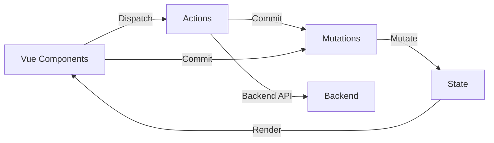

## 什么是Vuex？

Vuex是一个专为Vue.js应用程序开发的**状态管理模式**。它采用集中式存储管理应用的所有组件的状态,并以相应的规则保证状态以一种可预测的方式发生变化。

### 为什么需要Vuex？

当应用变得复杂时,多个组件共享状态会遇到问题:

- 多个视图依赖于同一状态
- 来自不同视图的行为需要变更同一状态

传统的父子组件通信方式会变得非常繁琐。Vuex通过提取组件的共享状态,以全局单例模式管理,解决了这些问题。

### Vuex的核心概念



## 安装Vuex

### CDN引入

```html
<script src="https://cdn.jsdelivr.net/npm/vue@2.7.14/dist/vue.js"></script>
<script src="https://cdn.jsdelivr.net/npm/vuex@3.6.2/dist/vuex.js"></script>
```

### NPM安装

```bash
npm install vuex@3.6.2
```

```js
import Vue from 'vue'
import Vuex from 'vuex'

Vue.use(Vuex)
```

## 基础使用

### 创建Store

```js
const store = new Vuex.Store({
    state: {
        count: 0
    },
    mutations: {
        increment(state) {
            state.count++
        }
    }
})
```

### 在Vue实例中使用

```js
new Vue({
    el: '#app',
    store,
    computed: {
        count() {
            return this.$store.state.count
        }
    },
    methods: {
        increment() {
            this.$store.commit('increment')
        }
    }
})
```

## State - 状态

State是Vuex的单一状态树,包含全部应用层级状态。

### 在组件中访问State

```js
// 方法1: 直接访问
computed: {
    count() {
        return this.$store.state.count
    }
}

// 方法2: 使用mapState辅助函数
import { mapState } from 'vuex'

computed: {
    ...mapState(['count', 'user', 'token'])
}

// 方法3: 使用对象形式
computed: {
    ...mapState({
        // 箭头函数
        count: state => state.count,
        
        // 传字符串 'count' 等同于 state => state.count
        countAlias: 'count',
        
        // 使用常规函数以便访问this
        countPlusLocalState(state) {
            return state.count + this.localCount
        }
    })
}
```

## Getter - 派生状态

Getter可以认为是store的计算属性,用于从state派生出一些状态。

### 定义Getter

```js
const store = new Vuex.Store({
    state: {
        todos: [
            { id: 1, text: '学习Vue', done: true },
            { id: 2, text: '学习Vuex', done: false },
            { id: 3, text: '学习Vue Router', done: false }
        ]
    },
    getters: {
        // 获取已完成的todos
        doneTodos: state => {
            return state.todos.filter(todo => todo.done)
        },
        
        // 获取已完成todos的数量
        doneTodosCount: (state, getters) => {
            return getters.doneTodos.length
        },
        
        // 返回一个函数,实现传参
        getTodoById: state => id => {
            return state.todos.find(todo => todo.id === id)
        }
    }
})
```

### 在组件中访问Getter

```js
// 方法1: 直接访问
computed: {
    doneTodos() {
        return this.$store.getters.doneTodos
    },
    doneTodosCount() {
        return this.$store.getters.doneTodosCount
    }
}

// 方法2: 使用mapGetters辅助函数
import { mapGetters } from 'vuex'

computed: {
    ...mapGetters(['doneTodos', 'doneTodosCount'])
}

// 方法3: 重命名
computed: {
    ...mapGetters({
        doneList: 'doneTodos',
        doneCount: 'doneTodosCount'
    })
}

// 访问带参数的getter
methods: {
    getTodo(id) {
        return this.$store.getters.getTodoById(id)
    }
}
```

## Mutation - 同步修改状态

更改Vuex的store中的状态的唯一方法是提交mutation。

### 定义Mutation

```js
const store = new Vuex.Store({
    state: {
        count: 0,
        user: null
    },
    mutations: {
        // 简单mutation
        increment(state) {
            state.count++
        },
        
        // 带参数的mutation
        incrementBy(state, n) {
            state.count += n
        },
        
        // 对象参数
        setUser(state, user) {
            state.user = user
        },
        
        // 使用常量定义mutation类型
        [INCREMENT](state) {
            state.count++
        }
    }
})
```

### 提交Mutation

```js
// 方法1: 直接提交
this.$store.commit('increment')

// 方法2: 带参数提交
this.$store.commit('incrementBy', 10)

// 方法3: 对象风格提交
this.$store.commit({
    type: 'incrementBy',
    amount: 10
})

// 方法4: 使用mapMutations辅助函数
import { mapMutations } from 'vuex'

methods: {
    ...mapMutations(['increment', 'incrementBy', 'setUser']),
    
    // 映射为不同名称
    ...mapMutations({
        add: 'increment'
    })
}
```

:::important[Mutation必须是同步函数]
Mutation必须是同步函数,因为异步操作会让状态变化变得不可追踪。异步操作应该使用Action。
:::

## Action - 异步操作

Action类似于mutation,不同在于:

- Action提交的是mutation,而不是直接变更状态
- Action可以包含任意异步操作

### 定义Action

```js
const store = new Vuex.Store({
    state: {
        count: 0,
        user: null
    },
    mutations: {
        increment(state) {
            state.count++
        },
        setUser(state, user) {
            state.user = user
        }
    },
    actions: {
        // 简单action
        increment(context) {
            context.commit('increment')
        },
        
        // 使用解构简化参数
        incrementAsync({ commit }) {
            setTimeout(() => {
                commit('increment')
            }, 1000)
        },
        
        // 异步请求
        async fetchUser({ commit }, userId) {
            try {
                const response = await fetch(`/api/users/${userId}`)
                const user = await response.json()
                commit('setUser', user)
                return user
            } catch (error) {
                console.error('获取用户失败:', error)
                throw error
            }
        },
        
        // action可以分发其他action
        async login({ dispatch, commit }, credentials) {
            const user = await dispatch('fetchUser', credentials.userId)
            commit('setToken', user.token)
            return user
        }
    }
})
```

### 分发Action

```js
// 方法1: 直接分发
this.$store.dispatch('increment')

// 方法2: 带参数分发
this.$store.dispatch('incrementAsync', { amount: 10 })

// 方法3: 对象风格分发
this.$store.dispatch({
    type: 'incrementAsync',
    amount: 10
})

// 方法4: 处理异步结果
this.$store.dispatch('fetchUser', 123)
    .then(user => {
        console.log('用户信息:', user)
    })
    .catch(error => {
        console.error('错误:', error)
    })

// 方法5: 使用mapActions辅助函数
import { mapActions } from 'vuex'

methods: {
    ...mapActions(['increment', 'fetchUser']),
    
    // 映射为不同名称
    ...mapActions({
        add: 'increment'
    })
}
```

## Module - 模块化

当应用变得复杂时,store会变得臃肿。Vuex允许我们将store分割成模块。

### 定义Module

```js
// user模块
const user = {
    namespaced: true,  // 开启命名空间
    state: {
        currentUser: null,
        token: null
    },
    getters: {
        isLoggedIn: state => !!state.token,
        username: state => state.currentUser?.name || '游客'
    },
    mutations: {
        setUser(state, user) {
            state.currentUser = user
        },
        setToken(state, token) {
            state.token = token
        }
    },
    actions: {
        async login({ commit }, credentials) {
            // 模拟登录请求
            const response = await fetch('/api/login', {
                method: 'POST',
                body: JSON.stringify(credentials)
            })
            const data = await response.json()
            commit('setUser', data.user)
            commit('setToken', data.token)
            return data
        },
        logout({ commit }) {
            commit('setUser', null)
            commit('setToken', null)
        }
    }
}

// cart模块
const cart = {
    namespaced: true,
    state: {
        items: []
    },
    getters: {
        cartTotal: state => {
            return state.items.reduce((total, item) => {
                return total + item.price * item.quantity
            }, 0)
        },
        cartItemCount: state => {
            return state.items.reduce((count, item) => {
                return count + item.quantity
            }, 0)
        }
    },
    mutations: {
        addToCart(state, product) {
            const item = state.items.find(i => i.id === product.id)
            if (item) {
                item.quantity++
            } else {
                state.items.push({ ...product, quantity: 1 })
            }
        },
        removeFromCart(state, productId) {
            const index = state.items.findIndex(i => i.id === productId)
            if (index > -1) {
                state.items.splice(index, 1)
            }
        },
        clearCart(state) {
            state.items = []
        }
    },
    actions: {
        async checkout({ state, commit }) {
            // 模拟结账请求
            const response = await fetch('/api/checkout', {
                method: 'POST',
                body: JSON.stringify(state.items)
            })
            const data = await response.json()
            commit('clearCart')
            return data
        }
    }
}

// 组合模块
const store = new Vuex.Store({
    modules: {
        user,
        cart
    }
})
```

### 访问模块

```js
// 访问state
this.$store.state.user.currentUser
this.$store.state.cart.items

// 访问getter
this.$store.getters['user/isLoggedIn']
this.$store.getters['cart/cartTotal']

// 提交mutation
this.$store.commit('user/setUser', user)
this.$store.commit('cart/addToCart', product)

// 分发action
this.$store.dispatch('user/login', credentials)
this.$store.dispatch('cart/checkout')

// 使用辅助函数
import { mapState, mapGetters, mapMutations, mapActions } from 'vuex'

computed: {
    ...mapState('user', ['currentUser', 'token']),
    ...mapState('cart', ['items']),
    ...mapGetters('user', ['isLoggedIn', 'username']),
    ...mapGetters('cart', ['cartTotal', 'cartItemCount'])
},
methods: {
    ...mapMutations('cart', ['addToCart', 'removeFromCart']),
    ...mapActions('user', ['login', 'logout']),
    ...mapActions('cart', ['checkout'])
}
```

## 实战练习: 购物车应用

创建一个完整的购物车应用,使用Vuex管理状态:

```html
<!DOCTYPE html>
<html lang="zh-CN">
<head>
    <meta charset="UTF-8">
    <title>Vuex购物车</title>
    <script src="https://cdn.jsdelivr.net/npm/vue@2.7.14/dist/vue.js"></script>
    <script src="https://cdn.jsdelivr.net/npm/vuex@3.6.2/dist/vuex.js"></script>
    <style>
        * { margin: 0; padding: 0; box-sizing: border-box; }
        body {
            font-family: Arial, sans-serif;
            background: #f5f5f5;
            padding: 20px;
        }
        #app {
            max-width: 1200px;
            margin: 0 auto;
        }
        .header {
            background: white;
            padding: 20px;
            border-radius: 10px;
            margin-bottom: 20px;
            box-shadow: 0 2px 10px rgba(0,0,0,0.1);
            display: flex;
            justify-content: space-between;
            align-items: center;
        }
        .cart-info {
            font-size: 18px;
            color: #333;
        }
        .cart-badge {
            background: #e74c3c;
            color: white;
            padding: 5px 10px;
            border-radius: 15px;
            margin-left: 10px;
        }
        .products {
            display: grid;
            grid-template-columns: repeat(auto-fill, minmax(250px, 1fr));
            gap: 20px;
            margin-bottom: 20px;
        }
        .product-card {
            background: white;
            padding: 20px;
            border-radius: 10px;
            box-shadow: 0 2px 10px rgba(0,0,0,0.1);
        }
        .product-image {
            width: 100%;
            height: 150px;
            background: linear-gradient(135deg, #667eea 0%, #764ba2 100%);
            border-radius: 8px;
            display: flex;
            align-items: center;
            justify-content: center;
            font-size: 48px;
            margin-bottom: 15px;
        }
        .product-name {
            font-size: 18px;
            font-weight: bold;
            margin-bottom: 10px;
        }
        .product-price {
            font-size: 24px;
            color: #e74c3c;
            margin-bottom: 15px;
        }
        .product-stock {
            color: #27ae60;
            margin-bottom: 15px;
        }
        .btn {
            width: 100%;
            padding: 10px;
            border: none;
            border-radius: 5px;
            background: #42b983;
            color: white;
            font-size: 16px;
            cursor: pointer;
        }
        .btn:hover {
            background: #35a372;
        }
        .btn:disabled {
            background: #ccc;
            cursor: not-allowed;
        }
        .cart {
            background: white;
            padding: 20px;
            border-radius: 10px;
            box-shadow: 0 2px 10px rgba(0,0,0,0.1);
        }
        .cart h2 {
            margin-bottom: 20px;
        }
        .cart-item {
            display: flex;
            justify-content: space-between;
            align-items: center;
            padding: 15px 0;
            border-bottom: 1px solid #eee;
        }
        .cart-item-info {
            flex: 1;
        }
        .cart-item-name {
            font-weight: bold;
            margin-bottom: 5px;
        }
        .cart-item-price {
            color: #e74c3c;
        }
        .cart-item-quantity {
            display: flex;
            align-items: center;
            gap: 10px;
            margin: 0 20px;
        }
        .quantity-btn {
            width: 30px;
            height: 30px;
            border: 1px solid #ddd;
            background: white;
            border-radius: 5px;
            cursor: pointer;
        }
        .remove-btn {
            background: #e74c3c;
            color: white;
            border: none;
            padding: 8px 15px;
            border-radius: 5px;
            cursor: pointer;
        }
        .cart-total {
            margin-top: 20px;
            padding-top: 20px;
            border-top: 2px solid #eee;
            font-size: 24px;
            font-weight: bold;
            display: flex;
            justify-content: space-between;
            align-items: center;
        }
        .checkout-btn {
            padding: 15px 40px;
            background: #42b983;
            color: white;
            border: none;
            border-radius: 5px;
            font-size: 18px;
            cursor: pointer;
        }
        .empty-cart {
            text-align: center;
            color: #999;
            padding: 40px;
        }
    </style>
</head>
<body>
    <div id="app">
        <div class="header">
            <h1>🛒 Vuex 购物车</h1>
            <div class="cart-info">
                购物车
                <span class="cart-badge">{{ cartItemCount }}</span>
                总计: ¥{{ cartTotal }}
            </div>
        </div>

        <div class="products">
            <div 
                v-for="product in products" 
                :key="product.id"
                class="product-card"
            >
                <div class="product-image">{{ product.icon }}</div>
                <div class="product-name">{{ product.name }}</div>
                <div 
class="product-price">¥{{ product.price }}</div>
                <div class="product-stock">库存: {{ product.inventory }}</div>
                <button 
                    class="btn"
                    @click="addToCart(product)"
                    :disabled="product.inventory === 0"
                >
                    {{ product.inventory > 0 ? '加入购物车' : '已售罄' }}
                </button>
            </div>
        </div>

        <div class="cart">
            <h2>购物车</h2>
            <div v-if="cartItems.length === 0" class="empty-cart">
                购物车是空的
            </div>
            <div v-else>
                <div 
                    v-for="item in cartItems" 
                    :key="item.id"
                    class="cart-item"
                >
                    <div class="cart-item-info">
                        <div class="cart-item-name">{{ item.name }}</div>
                        <div class="cart-item-price">¥{{ item.price }}</div>
                    </div>
                    <div class="cart-item-quantity">
                        <button class="quantity-btn" @click="decrementItem(item)">-</button>
                        <span>{{ item.quantity }}</span>
                        <button class="quantity-btn" @click="incrementItem(item)">+</button>
                    </div>
                    <button class="remove-btn" @click="removeFromCart(item.id)">
                        删除
                    </button>
                </div>
                <div class="cart-total">
                    <span>总计:</span>
                    <div>
                        <span>¥{{ cartTotal }}</span>
                        <button class="checkout-btn" @click="checkout">
                            结算
                        </button>
                    </div>
                </div>
            </div>
        </div>
    </div>

    <script>
        // 创建Vuex Store
        const store = new Vuex.Store({
            state: {
                products: [
                    { id: 1, name: '苹果手机', price: 6999, inventory: 5, icon: '📱' },
                    { id: 2, name: '笔记本电脑', price: 8999, inventory: 3, icon: '💻' },
                    { id: 3, name: '蓝牙耳机', price: 299, inventory: 10, icon: '🎧' },
                    { id: 4, name: '智能手表', price: 1999, inventory: 0, icon: '⌚' },
                    { id: 5, name: '平板电脑', price: 3999, inventory: 7, icon: '📱' },
                    { id: 6, name: '相机', price: 12999, inventory: 2, icon: '📷' }
                ],
                cart: []
            },
            getters: {
                cartItems: state => {
                    return state.cart.map(cartItem => {
                        const product = state.products.find(p => p.id === cartItem.id)
                        return {
                            ...product,
                            quantity: cartItem.quantity
                        }
                    })
                },
                cartTotal: (state, getters) => {
                    return getters.cartItems.reduce((total, item) => {
                        return total + item.price * item.quantity
                    }, 0).toFixed(2)
                },
                cartItemCount: state => {
                    return state.cart.reduce((count, item) => {
                        return count + item.quantity
                    }, 0)
                }
            },
            mutations: {
                addToCart(state, product) {
                    const cartItem = state.cart.find(item => item.id === product.id)
                    if (cartItem) {
                        cartItem.quantity++
                    } else {
                        state.cart.push({
                            id: product.id,
                            quantity: 1
                        })
                    }
                    // 减少库存
                    product.inventory--
                },
                removeFromCart(state, productId) {
                    const cartItem = state.cart.find(item => item.id === productId)
                    if (cartItem) {
                        // 恢复库存
                        const product = state.products.find(p => p.id === productId)
                        product.inventory += cartItem.quantity
                        // 从购物车移除
                        const index = state.cart.indexOf(cartItem)
                        state.cart.splice(index, 1)
                    }
                },
                incrementItem(state, product) {
                    const cartItem = state.cart.find(item => item.id === product.id)
                    if (cartItem && product.inventory > 0) {
                        cartItem.quantity++
                        product.inventory--
                    }
                },
                decrementItem(state, product) {
                    const cartItem = state.cart.find(item => item.id === product.id)
                    if (cartItem) {
                        cartItem.quantity--
                        product.inventory++
                        if (cartItem.quantity === 0) {
                            const index = state.cart.indexOf(cartItem)
                            state.cart.splice(index, 1)
                        }
                    }
                },
                clearCart(state) {
                    state.cart = []
                }
            },
            actions: {
                addToCart({ commit, state }, product) {
                    if (product.inventory > 0) {
                        commit('addToCart', product)
                    } else {
                        alert('商品已售罄')
                    }
                },
                checkout({ commit, state, getters }) {
                    if (state.cart.length === 0) {
                        alert('购物车是空的')
                        return
                    }
                    
                    // 模拟结账
                    const total = getters.cartTotal
                    alert(`结算成功!\n总金额: ¥${total}`)
                    commit('clearCart')
                }
            }
        })

        // 创建Vue实例
        new Vue({
            el: '#app',
            store,
            computed: {
                ...Vuex.mapState(['products']),
                ...Vuex.mapGetters(['cartItems', 'cartTotal', 'cartItemCount'])
            },
            methods: {
                ...Vuex.mapActions(['addToCart', 'checkout']),
                ...Vuex.mapMutations(['removeFromCart', 'incrementItem', 'decrementItem'])
            }
        })
    </script>
</body>
</html>
```

## Vuex插件

Vuex的store可以接受plugins选项,用于在每次mutation后执行自定义逻辑。

### 持久化插件

```js
// 创建持久化插件
const persistPlugin = store => {
    // 从localStorage恢复状态
    const savedState = localStorage.getItem('vuex-state')
    if (savedState) {
        store.replaceState(JSON.parse(savedState))
    }
    
    // 订阅mutation,每次mutation后保存状态
    store.subscribe((mutation, state) => {
        localStorage.setItem('vuex-state', JSON.stringify(state))
    })
}

// 使用插件
const store = new Vuex.Store({
    // ...
    plugins: [persistPlugin]
})
```

### 日志插件

```js
const loggerPlugin = store => {
    store.subscribe((mutation, state) => {
        console.log('mutation:', mutation.type)
        console.log('payload:', mutation.payload)
        console.log('new state:', state)
    })
}
```

## 严格模式

在严格模式下,无论何时发生了状态变更且不是由mutation函数引起的,将会抛出错误。

```js
const store = new Vuex.Store({
    strict: true,  // 开启严格模式
    // ...
})

// 在生产环境关闭严格模式
const store = new Vuex.Store({
    strict: process.env.NODE_ENV !== 'production',
    // ...
})
```

## 表单处理

在Vuex中使用v-model需要特殊处理,因为v-model会直接修改状态。

### 方法1: 双向计算属性

```html
<input v-model="message">
```

```js
computed: {
    message: {
        get() {
            return this.$store.state.message
        },
        set(value) {
            this.$store.commit('updateMessage', value)
        }
    }
}
```

### 方法2: 使用@input

```html
<input :value="message" @input="updateMessage">
```

```js
computed: {
    message() {
        return this.$store.state.message
    }
},
methods: {
    updateMessage(e) {
        this.$store.commit('updateMessage', e.target.value)
    }
}
```

## 最佳实践

### 1. 合理划分模块

```js
// ✅ 推荐 - 按功能划分
const store = new Vuex.Store({
    modules: {
        user,      // 用户模块
        cart,      // 购物车模块
        products,  // 商品模块
        orders     // 订单模块
    }
})
```

### 2. 使用常量定义Mutation类型

```js
// mutation-types.js
export const INCREMENT = 'INCREMENT'
export const SET_USER = 'SET_USER'

// store.js
import { INCREMENT, SET_USER } from './mutation-types'

const store = new Vuex.Store({
    mutations: {
        [INCREMENT](state) {
            state.count++
        },
        [SET_USER](state, user) {
            state.user = user
        }
    }
})
```

### 3. 异步操作放在Action中

```js
// ❌ 不推荐 - 在组件中直接异步操作
methods: {
    async fetchData() {
        const data = await api.getData()
        this.$store.commit('setData', data)
    }
}

// ✅ 推荐 - 在Action中处理异步操作
actions: {
    async fetchData({ commit }) {
        const data = await api.getData()
        commit('setData', data)
    }
}
```

### 4. 使用辅助函数简化代码

```js
// ❌ 不推荐 - 重复代码多
computed: {
    count() {
        return this.$store.state.count
    },
    user() {
        return this.$store.state.user
    }
}

// ✅ 推荐 - 使用mapState
computed: {
    ...mapState(['count', 'user'])
}
```

### 5. Getter用于派生状态

```js
// ✅ 推荐 - 复杂计算放在getter中
getters: {
    expensiveComputation(state) {
        return state.items
            .filter(item => item.active)
            .map(item => item.value * 2)
            .reduce((sum, val) => sum + val, 0)
    }
}
```

## 常见问题

### Q1: 何时使用Vuex?

**使用Vuex的情况**:
- 多个组件需要共享状态
- 需要在不同视图间传递状态
- 需要调试和追踪状态变化
- 应用规模较大,状态管理复杂

**不需要Vuex的情况**:
- 小型应用
- 组件间通信简单
- 状态只在少数组件间共享

### Q2: Mutation和Action的区别?

| 特性 | Mutation | Action |
|-----|----------|--------|
| 同步/异步 | 必须同步 | 可以异步 |
| 作用 | 修改状态 | 提交mutation |
| 调用方式 | commit | dispatch |
| 参数 | (state, payload) | (context, payload) |

### Q3: 如何重置Store状态?

```js
// 方法1: 定义初始状态
const initialState = () => ({
    count: 0,
    user: null
})

const store = new Vuex.Store({
    state: initialState(),
    mutations: {
        reset(state) {
            Object.assign(state, initialState())
        }
    }
})

// 方法2: 使用replaceState
store.replaceState(initialState())
```

## 学习建议

1. **理解单向数据流**: 掌握Vuex的数据流向
2. **循序渐进**: 先学State和Mutation,再学Action和Module
3. **实践项目**: 通过实际项目理解Vuex的价值
4. **合理使用**: 不是所有状态都需要放在Vuex中
5. **配合DevTools**: 使用Vue DevTools调试Vuex

## 总结

本文详细介绍了Vuex状态管理:

- Vuex的核心概念和工作原理
- State、Getter、Mutation、Action的使用
- Module实现模块化状态管理
- 辅助函数简化代码
- Vuex插件和严格模式
- 实战项目和最佳实践

Vuex是Vue生态系统中重要的状态管理工具,掌握它对于开发大型Vue应用至关重要。至此,Vue2全家桶的核心内容已经全部学完,你已经具备开发完整Vue应用的能力了!

## Vue2全家桶系列完结

恭喜你完成了Vue2全家桶系列教程!回顾一下我们学习的内容:

1. **Vue2基础** - 指令、计算属性、侦听器、生命周期
2. **组件系统** - Props、事件、插槽、组件通信
3. **Vue Router** - 路由配置、导航守卫、嵌套路由
4. **Vuex** - 状态管理、模块化、最佳实践

### 继续学习

- 🎯 **Vue CLI** - 项目脚手架和工程化
- 📦 **组件库** - Element UI、Vant等
- 🔧 **工具链** - Webpack、Babel、ESLint
- 🚀 **Vue3** - Composition API、新特性

:::tip[系列文章]
👉 第一篇: [Vue2入门教程(一) - 基础知识](/posts/vue2-basics/)

👉 第二篇: [Vue2入门教程(二) - 组件与通信](/posts/vue2-components/)

👉 第三篇: [Vue2入门教程(三) - Vue Router路由](/posts/vue2-router/)

👉 第四篇: Vue2入门教程(四) - Vuex状态管理 (当前)
:::

**感谢学习,祝你在Vue开发的道路上越走越远!** 🎉