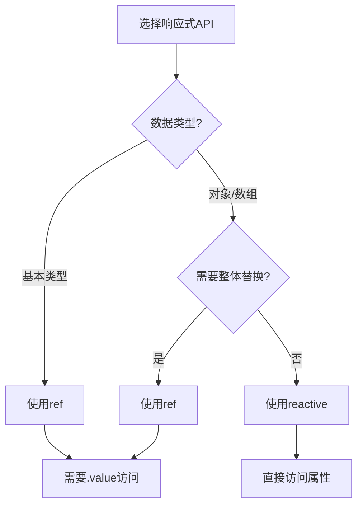
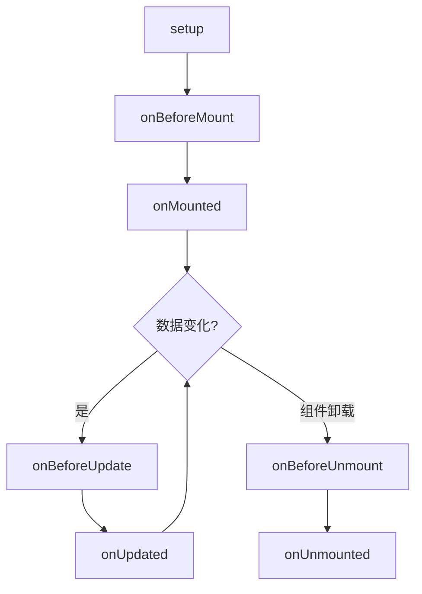

---
title: Vue3入门教程(一) - 基础知识与Composition API
published: 2024-01-07
pinned: false
description: 全面学习Vue3的核心特性,深入理解Composition API、响应式系统、生命周期等新特性,从Vue2平滑过渡到Vue3。
tags: [Vue3, Composition API, 响应式, 前端, 教程]
category: 技术教程
draft: false
---

## 📚 Vue3系列教程导航

- **Vue3入门教程(一) - 基础知识与Composition API** (当前)
- [Vue3入门教程(二) - 组件与组合式函数](/posts/vue3-composables/)
- [Vue3入门教程(三) - Vite项目构建](/posts/vue3-vite/)
- [Vue3入门教程(四) - Pinia状态管理](/posts/vue3-pinia/)
- [Vue3入门教程(五) - TypeScript实战](/posts/vue3-ts/)

## Vue3简介

Vue3是Vue.js的最新主版本,于2020年9月发布。它在保持Vue2核心理念的同时,带来了许多重大改进和新特性。

### Vue3的主要特性

- 🚀 **性能提升** - 比Vue2快1.3-2倍
- 📦 **体积更小** - Tree-shaking后最小13.5KB
- 🔥 **Composition API** - 更好的逻辑复用和代码组织
- 📝 **TypeScript支持** - 完全用TypeScript重写
- ⚡️ **更好的响应式系统** - 基于Proxy的响应式
- 🎯 **Fragment、Teleport、Suspense** - 新的内置组件

### Vue3 vs Vue2对比

| 特性 | Vue2 | Vue3 |
|------|------|------|
| 响应式实现 | Object.defineProperty | Proxy |
| 主要API | Options API | Composition API |
| TypeScript支持 | 部分支持 | 完全支持 |
| 性能 | 基准 | 快1.3-2倍 |
| 包体积 | 较大 | 更小(Tree-shaking) |
| 多根节点 | 不支持 | 支持(Fragment) |

## 安装Vue3

### 方式一: CDN引入

```html
<!-- 开发环境 -->
<script src="https://unpkg.com/vue@3/dist/vue.global.js"></script>

<!-- 生产环境 -->
<script src="https://unpkg.com/vue@3/dist/vue.global.prod.js"></script>
```

### 方式二: npm安装

```bash
npm install vue@latest
```

### 方式三: 使用Vite创建项目(推荐)

```bash
# 使用npm
npm create vite@latest my-vue3-app -- --template vue

# 使用yarn
yarn create vite my-vue3-app --template vue

# 使用pnpm
pnpm create vite my-vue3-app --template vue
```

## 第一个Vue3应用

让我们创建第一个Vue3应用,体验新特性:

```html
<!DOCTYPE html>
<html lang="zh-CN">
<head>
    <meta charset="UTF-8">
    <title>我的第一个Vue3应用</title>
    <script src="https://unpkg.com/vue@3/dist/vue.global.js"></script>
    <style>
        body {
            font-family: Arial, sans-serif;
            max-width: 800px;
            margin: 50px auto;
            padding: 20px;
        }
        .counter {
            text-align: center;
            padding: 40px;
            background: linear-gradient(135deg, #667eea 0%, #764ba2 100%);
            color: white;
            border-radius: 10px;
        }
        .counter h1 {
            font-size: 48px;
            margin: 20px 0;
        }
        button {
            padding: 12px 30px;
            margin: 10px;
            font-size: 16px;
            border: none;
            border-radius: 5px;
            cursor: pointer;
            background: white;
            color: #667eea;
            transition: transform 0.2s;
        }
        button:hover {
            transform: scale(1.1);
        }
    </style>
</head>
<body>
    <div id="app">
        <div class="counter">
            <h2>{{ message }}</h2>
            <h1>{{ count }}</h1>
            <button @click="increment">增加</button>
            <button @click="decrement">减少</button>
            <button @click="reset">重置</button>
        </div>
    </div>

    <script>
        const { createApp, ref } = Vue

        createApp({
            setup() {
                // 响应式数据
                const message = ref('计数器')
                const count = ref(0)

                // 方法
                const increment = () => count.value++
                const decrement = () => count.value--
                const reset = () => count.value = 0

                // 返回给模板使用
                return {
                    message,
                    count,
                    increment,
                    decrement,
                    reset
                }
            }
        }).mount('#app')
    </script>
</body>
</html>
```

## Composition API核心概念

Composition API是Vue3最重要的新特性,它提供了一种更灵活的方式来组织组件逻辑。

### setup函数

`setup`是Composition API的入口点,在组件创建之前执行。

```js
export default {
    setup(props, context) {
        // props: 组件接收的属性
        // context: 包含attrs、slots、emit等
        
        // 在这里定义响应式数据、计算属性、方法等
        
        return {
            // 返回的内容可以在模板中使用
        }
    }
}
```

### ref - 响应式引用

`ref`用于创建响应式的基本数据类型或对象引用:

```js
import { ref } from 'vue'

export default {
    setup() {
        // 基本类型
        const count = ref(0)
        const message = ref('Hello Vue3')
        
        // 对象
        const user = ref({
            name: '张三',
            age: 25
        })
        
        // 访问和修改值需要使用.value
        console.log(count.value) // 0
        count.value++
        console.log(count.value) // 1
        
        // 在模板中不需要.value
        return {
            count,
            message,
            user
        }
    }
}
```

```html
<template>
    <div>
        <p>{{ count }}</p>  <!-- 不需要.value -->
        <p>{{ message }}</p>
        <p>{{ user.name }} - {{ user.age }}岁</p>
    </div>
</template>
```

### reactive - 响应式对象

`reactive`用于创建响应式对象,更适合复杂的对象结构:

```js
import { reactive } from 'vue'

export default {
    setup() {
        // 创建响应式对象
        const state = reactive({
            count: 0,
            message: 'Hello',
            user: {
                name: '张三',
                age: 25
            },
            todos: [
                { id: 1, text: '学习Vue3', done: false },
                { id: 2, text: '学习Composition API', done: false }
            ]
        })
        
        // 直接访问和修改,不需要.value
        state.count++
        state.user.name = '李四'
        state.todos[0].done = true
        
        return {
            state
        }
    }
}
```

### ref vs reactive



**使用建议**:
- 基本类型数据用`ref`
- 对象/数组且不需要整体替换用`reactive`
- 对象/数组需要整体替换用`ref`

```js
import { ref, reactive } from 'vue'

// ✅ 推荐
const count = ref(0)
const state = reactive({
    name: '张三',
    age: 25
})

// ❌ 不推荐
const count = reactive({ value: 0 })

// 需要整体替换时使用ref
const user = ref({ name: '张三', age: 25 })
user.value = { name: '李四', age: 30 } // 可以整体替换

// reactive不能整体替换
const state = reactive({ name: '张三', age: 25 })
state = { name: '李四', age: 30 } // ❌ 失去响应式
```

### computed - 计算属性

计算属性在Composition API中使用`computed`函数:

```js
import { ref, computed } from 'vue'

export default {
    setup() {
        const firstName = ref('三')
        const lastName = ref('张')
        
        // 只读计算属性
        const fullName = computed(() => {
            return lastName.value + firstName.value
        })
        
        // 可写计算属性
        const fullNameWritable = computed({
            get() {
                return lastName.value + firstName.value
            },
            set(value) {
                lastName.value = value[0]
                firstName.value = value.slice(1)
            }
        })
        
        return {
            firstName,
            lastName,
            fullName,
            fullNameWritable
        }
    }
}
```

### watch - 侦听器

Vue3提供了`watch`和`watchEffect`两个侦听器:

```js
import { ref, reactive, watch, watchEffect } from 'vue'

export default {
    setup() {
        const count = ref(0)
        const state = reactive({
            name: '张三',
            age: 25
        })
        
        // 侦听ref
        watch(count, (newValue, oldValue) => {
            console.log(`count从${oldValue}变为${newValue}`)
        })
        
        // 侦听reactive对象的属性
        watch(
            () => state.name,
            (newValue, oldValue) => {
                console.log(`name从${oldValue}变为${newValue}`)
            }
        )
        
        // 侦听多个源
        watch(
            [count, () => state.name],
            ([newCount, newName], [oldCount, oldName]) => {
                console.log('count或name发生了变化')
            }
        )
        
        // 深度侦听
        watch(
            () => state,
            (newValue, oldValue) => {
                console.log('state深度变化')
            },
            { deep: true }
        )
        
        // 立即执行侦听器
        watch(
            count,
            (newValue) => {
                console.log('count:', newValue)
            },
            { immediate: true }
        )
        
        // watchEffect - 自动追踪依赖
        watchEffect(() => {
            console.log(`count是${count.value}, name是${state.name}`)
            // 自动追踪count和state.name的变化
        })
        
        return {
            count,
            state
        }
    }
}
```

### watch vs watchEffect

| 特性 | watch | watchEffect |
|------|-------|-------------|
| 依赖追踪 | 手动指定 | 自动追踪 |
| 访问旧值 | 可以 | 不可以 |
| 执行时机 | 数据变化时 | 立即执行+数据变化时 |
| 使用场景 | 明确知道要侦听什么 | 侦听多个响应式数据 |

## 生命周期钩子

Vue3的Composition API提供了新的生命周期钩子:

```js
import {
    onBeforeMount,
    onMounted,
    onBeforeUpdate,
    onUpdated,
    onBeforeUnmount,
    onUnmounted
} from 'vue'

export default {
    setup() {
        console.log('setup执行')
        
        onBeforeMount(() => {
            console.log('组件挂载前')
        })
        
        onMounted(() => {
            console.log('组件挂载后')
            // 可以访问DOM
        })
        
        onBeforeUpdate(() => {
            console.log('组件更新前')
        })
        
        onUpdated(() => {
            console.log('组件更新后')
        })
        
        onBeforeUnmount(() => {
            console.log('组件卸载前')
        })
        
        onUnmount(() => {
            console.log('组件卸载后')
            // 清理工作,如定时器、事件监听
        })
    }
}
```

### 生命周期对比

| Vue2 Options API | Vue3 Composition API |
|-----------------|---------------------|
| beforeCreate | setup() |
| created | setup() |
| beforeMount | onBeforeMount |
| mounted | onMounted |
| beforeUpdate | onBeforeUpdate |
| updated | onUpdated |
| beforeDestroy | onBeforeUnmount |
| destroyed | onUnmounted |



## 模板新特性

### Fragment - 多根节点

Vue3支持组件有多个根节点:

```vue
<template>
    <!-- Vue2中必须有一个根节点 -->
    <!-- <div> -->
        <header>头部</header>
        <main>主要内容</main>
        <footer>底部</footer>
    <!-- </div> -->
</template>
```

### Teleport - 传送门

将组件的一部分传送到DOM的其他位置:

```vue
<template>
    <div>
        <h1>我的应用</h1>
        
        <!-- 传送到body -->
        <Teleport to="body">
            <div class="modal">
                <p>这是一个模态框</p>
            </div>
        </Teleport>
    </div>
</template>
```

### Suspense - 异步组件

处理异步组件的加载状态:

```vue
<template>
    <Suspense>
        <!-- 异步组件 -->
        <template #default>
            <AsyncComponent />
        </template>
        
        <!-- 加载中显示 -->
        <template #fallback>
            <div>加载中...</div>
        </template>
    </Suspense>
</template>

<script>
import { defineAsyncComponent } from 'vue'

export default {
    components: {
        AsyncComponent: defineAsyncComponent(() =>
            import('./AsyncComponent.vue')
        )
    }
}
</script>
```

## 实战练习: Todo应用

让我们用Composition API创建一个完整的Todo应用:

```html
<!DOCTYPE html>
<html lang="zh-CN">
<head>
    <meta charset="UTF-8">
    <title>Vue3 Todo应用</title>
    <script src="https://unpkg.com/vue@3/dist/vue.global.js"></script>
    <style>
        * { margin: 0; padding: 0; box-sizing: border-box; }
        body {
            font-family: Arial, sans-serif;
            background: linear-gradient(135deg, #667eea 0%, #764ba2 100%);
            min-height: 100vh;
            display: flex;
            justify-content: center;
            align-items: center;
            padding: 20px;
        }
        #app {
            background: white;
            border-radius: 15px;
            padding: 40px;
            box-shadow: 0 20px 60px rgba(0,0,0,0.3);
            width: 100%;
            max-width: 500px;
        }
        h1 {
            text-align: center;
            color: #333;
            margin-bottom: 
30px;
        }
        .input-box {
            display: flex;
            gap: 10px;
            margin-bottom: 20px;
        }
        input[type="text"] {
            flex: 1;
            padding: 12px;
            border: 2px solid #ddd;
            border-radius: 8px;
            font-size: 16px;
        }
        button {
            padding: 12px 24px;
            background: #667eea;
            color: white;
            border: none;
            border-radius: 8px;
            cursor: pointer;
            font-size: 16px;
            transition: background 0.3s;
        }
        button:hover {
            background: #764ba2;
        }
        .filters {
            display: flex;
            gap: 10px;
            justify-content: center;
            margin-bottom: 20px;
        }
        .filters button {
            background: #f0f0f0;
            color: #333;
            padding: 8px 16px;
        }
        .filters button.active {
            background: #667eea;
            color: white;
        }
        .todo-list {
            list-style: none;
        }
        .todo-item {
            display: flex;
            align-items: center;
            padding: 15px;
            border-bottom: 1px solid #eee;
            transition: background 0.3s;
        }
        .todo-item:hover {
            background: #f9f9f9;
        }
        .todo-item.completed .todo-text {
            text-decoration: line-through;
            color: #999;
        }
        .todo-checkbox {
            margin-right: 12px;
            width: 20px;
            height: 20px;
            cursor: pointer;
        }
        .todo-text {
            flex: 1;
            font-size: 16px;
        }
        .delete-btn {
            background: #e74c3c;
            padding: 6px 12px;
            font-size: 14px;
        }
        .stats {
            text-align: center;
            margin-top: 20px;
            color: #666;
        }
    </style>
</head>
<body>
    <div id="app">
        <h1>📝 Vue3 Todo应用</h1>
        
        <!-- 输入框 -->
        <div class="input-box">
            <input 
                v-model="newTodo"
                @keyup.enter="addTodo"
                type="text" 
                placeholder="添加新任务..."
            >
            <button @click="addTodo">添加</button>
        </div>
        
        <!-- 过滤按钮 -->
        <div class="filters">
            <button 
                :class="{ active: filter === 'all' }"
                @click="filter = 'all'"
            >全部</button>
            <button 
                :class="{ active: filter === 'active' }"
                @click="filter = 'active'"
            >进行中</button>
            <button 
                :class="{ active: filter === 'completed' }"
                @click="filter = 'completed'"
            >已完成</button>
        </div>
        
        <!-- 任务列表 -->
        <ul class="todo-list">
            <li 
                v-for="todo in filteredTodos" 
                :key="todo.id"
                :class="['todo-item', { completed: todo.completed }]"
            >
                <input 
                    type="checkbox" 
                    class="todo-checkbox"
                    v-model="todo.completed"
                >
                <span class="todo-text">{{ todo.text }}</span>
                <button class="delete-btn" @click="deleteTodo(todo.id)">
                    删除
                </button>
            </li>
        </ul>
        
        <!-- 统计 -->
        <div class="stats">
            <p>共 {{ todos.length }} 项 | 
               已完成 {{ completedCount }} 项 | 
               剩余 {{ activeCount }} 项</p>
        </div>
    </div>

    <script>
        const { createApp, ref, computed } = Vue

        createApp({
            setup() {
                // 响应式数据
                const newTodo = ref('')
                const filter = ref('all')
                const todos = ref([
                    { id: 1, text: '学习Vue3基础', completed: true },
                    { id: 2, text: '掌握Composition API', completed: false },
                    { id: 3, text: '学习Pinia状态管理', completed: false }
                ])
                
                // 计算属性
                const filteredTodos = computed(() => {
                    switch (filter.value) {
                        case 'active':
                            return todos.value.filter(t => !t.completed)
                        case 'completed':
                            return todos.value.filter(t => t.completed)
                        default:
                            return todos.value
                    }
                })
                
                const completedCount = computed(() => {
                    return todos.value.filter(t => t.completed).length
                })
                
                const activeCount = computed(() => {
                    return todos.value.filter(t => !t.completed).length
                })
                
                // 方法
                const addTodo = () => {
                    const text = newTodo.value.trim()
                    if (text) {
                        todos.value.push({
                            id: Date.now(),
                            text,
                            completed: false
                        })
                        newTodo.value = ''
                    }
                }
                
                const deleteTodo = (id) => {
                    const index = todos.value.findIndex(t => t.id === id)
                    if (index > -1) {
                        todos.value.splice(index, 1)
                    }
                }
                
                return {
                    newTodo,
                    filter,
                    todos,
                    filteredTodos,
                    completedCount,
                    activeCount,
                    addTodo,
                    deleteTodo
                }
            }
        }).mount('#app')
    </script>
</body>
</html>
```

## 响应式原理

### Proxy vs Object.defineProperty

Vue3使用Proxy替代了Vue2的Object.defineProperty:

```js
// Vue2 - Object.defineProperty
const data = { count: 0 }
Object.defineProperty(data, 'count', {
    get() {
        console.log('读取count')
        return value
    },
    set(newValue) {
        console.log('设置count')
        value = newValue
    }
})

// Vue3 - Proxy
const data = new Proxy({ count: 0 }, {
    get(target, key) {
        console.log('读取', key)
        return target[key]
    },
    set(target, key, value) {
        console.log('设置', key)
        target[key] = value
        return true
    }
})
```

**Proxy的优势**:
- ✅ 可以监听数组变化
- ✅ 可以监听对象属性的添加和删除
- ✅ 性能更好
- ✅ 支持13种拦截操作

## `<script setup>` 语法糖

Vue3.2+引入了`<script setup>`,让代码更简洁:

### 传统写法

```vue
<template>
    <div>
        <p>{{ count }}</p>
        <button @click="increment">增加</button>
    </div>
</template>

<script>
import { ref } from 'vue'

export default {
    setup() {
        const count = ref(0)
        
        const increment = () => {
            count.value++
        }
        
        return {
            count,
            increment
        }
    }
}
</script>
```

### 使用`<script setup>`

```vue
<template>
    <div>
        <p>{{ count }}</p>
        <button @click="increment">增加</button>
    </div>
</template>

<script setup>
import { ref } from 'vue'

// 直接定义,不需要return
const count = ref(0)

const increment = () => {
    count.value++
}
</script>
```

### `<script setup>`的优势

- 📝 更少的样板代码
- 🚀 更好的TypeScript支持
- ⚡ 更好的运行时性能
- 🎯 更符合直觉的写法

## 组件通信

### Props

```vue
<!-- 父组件 -->
<template>
    <ChildComponent 
        :message="message"
        :count="count"
    />
</template>

<script setup>
import { ref } from 'vue'
import ChildComponent from './ChildComponent.vue'

const message = ref('Hello')
const count = ref(0)
</script>

<!-- 子组件 -->
<template>
    <div>
        <p>{{ message }}</p>
        <p>{{ count }}</p>
    </div>
</template>

<script setup>
// 使用defineProps声明props
const props = defineProps({
    message: String,
    count: {
        type: Number,
        default: 0
    }
})

// 可以直接使用props
console.log(props.message)
</script>
```

### Emits

```vue
<!-- 子组件 -->
<template>
    <button @click="handleClick">点击我</button>
</template>

<script setup>
// 使用defineEmits声明事件
const emit = defineEmits(['update', 'delete'])

const handleClick = () => {
    emit('update', { id: 1, name: '张三' })
}
</script>

<!-- 父组件 -->
<template>
    <ChildComponent 
        @update="handleUpdate"
        @delete="handleDelete"
    />
</template>

<script setup>
const handleUpdate = (data) => {
    console.log('更新:', data)
}

const handleDelete = () => {
    console.log('删除')
}
</script>
```

### v-model

Vue3的v-model有重大改进:

```vue
<!-- 父组件 -->
<template>
    <ChildComponent v-model="text" />
    <ChildComponent v-model:title="title" v-model:content="content" />
</template>

<script setup>
import { ref } from 'vue'

const text = ref('')
const title = ref('')
const content = ref('')
</script>

<!-- 子组件 - 默认v-model -->
<template>
    <input 
        :value="modelValue"
        @input="$emit('update:modelValue', $event.target.value)"
    >
</template>

<script setup>
defineProps(['modelValue'])
defineEmits(['update:modelValue'])
</script>

<!-- 子组件 - 具名v-model -->
<template>
    <input 
        :value="title"
        @input="$emit('update:title', $event.target.value)"
    >
    <textarea 
        :value="content"
        @input="$emit('update:content', $event.target.value)"
    />
</template>

<script setup>
defineProps(['title', 'content'])
defineEmits(['update:title', 'update:content'])
</script>
```

## 最佳实践

### 1. 合理使用ref和reactive

```js
// ✅ 推荐
const count = ref(0)
const user = reactive({
    name: '张三',
    age: 25
})

// ❌ 不推荐
const count = reactive({ value: 0 })
```

### 2. 解构reactive会失去响应式

```js
import { reactive, toRefs } from 'vue'

const state = reactive({
    count: 0,
    name: '张三'
})

// ❌ 错误 - 失去响应式
const { count, name } = state

// ✅ 正确 - 使用toRefs
const { count, name } = toRefs(state)
```

### 3. 避免在setup中使用this

```js
// ❌ 错误
setup() {
    console.log(this) // undefined
}

// ✅ 正确
setup(props, { emit }) {
    // 使用参数访问
}
```

### 4. computed vs 方法

```js
// ✅ 使用computed - 有缓存
const fullName = computed(() => {
    return firstName.value + lastName.value
})

// ❌ 使用方法 - 每次都执行
const fullName = () => {
    return firstName.value + lastName.value
}
```

### 5. watch的清理

```js
import { watch, onUnmounted } from 'vue'

const stopWatch = watch(source, callback)

// 在组件卸载时停止监听
onUnmounted(() => {
    stopWatch()
})

// 或者在watchEffect中返回清理函数
watchEffect((onCleanup) => {
    const timer = setTimeout(() => {}, 1000)
    
    onCleanup(() => {
        clearTimeout(timer)
    })
})
```

## 从Vue2迁移

### 主要变化

1. **创建应用**
```js
// Vue2
new Vue({
    el: '#app',
    // ...
})

// Vue3
createApp({
    // ...
}).mount('#app')
```

2. **全局API**
```js
// Vue2
Vue.component('MyComponent', {})
Vue.directive('focus', {})
Vue.use(VueRouter)

// Vue3
const app = createApp({})
app.component('MyComponent', {})
app.directive('focus', {})
app.use(VueRouter)
```

3. **生命周期**
```js
// Vue2
export default {
    beforeCreate() {},
    created() {},
    beforeMount() {},
    mounted() {}
}

// Vue3
import { onBeforeMount, onMounted } from 'vue'

export default {
    setup() {
        // beforeCreate和created在setup中
        onBeforeMount(() => {})
        onMounted(() => {})
    }
}
```

4. **过滤器移除**
```vue
<!-- Vue2 -->
<p>{{ price | currency }}</p>

<!-- Vue3 - 使用方法或计算属性 -->
<p>{{ formatCurrency(price) }}</p>
```

## 学习资源

### 官方文档
- [Vue3官方文档](https://cn.vuejs.org/)
- [Composition API文档](https://cn.vuejs.org/guide/extras/composition-api-faq.html)
- [Vue3迁移指南](https://v3-migration.vuejs.org/)

### 推荐阅读
- Vue3设计思想
- Composition API最佳实践
- Vue3性能优化指南

## 总结

本文详细介绍了Vue3的核心特性:

- ✅ Vue3的新特性和改进
- ✅ Composition API的核心概念(ref、reactive、computed、watch)
- ✅ 生命周期钩子的变化
- ✅ 模板新特性(Fragment、Teleport、Suspense)
- ✅ `<script setup>`语法糖
- ✅ 组件通信方式
- ✅ 最佳实践和迁移指南

Vue3的Composition API提供了更灵活的代码组织方式,配合响应式系统的升级,使得Vue3在性能和开发体验上都有显著提升。掌握这些核心概念后,你就可以开始使用Vue3开发现代化的Web应用了!

:::tip[继续学习]
👉 下一篇: [Vue3入门教程(二) - 组件与组合式函数](/posts/vue3-composables/)
:::